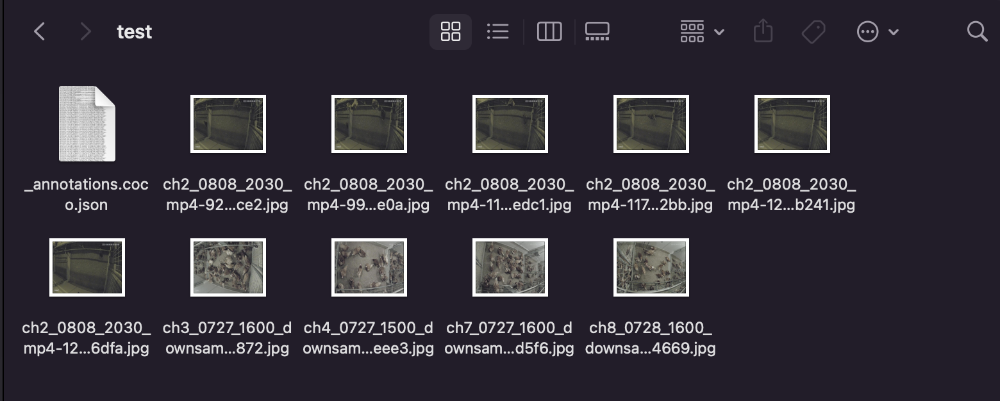
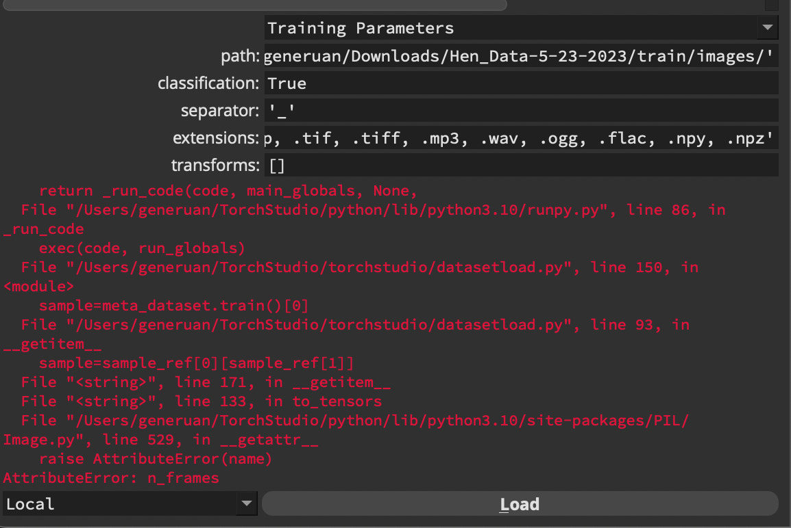
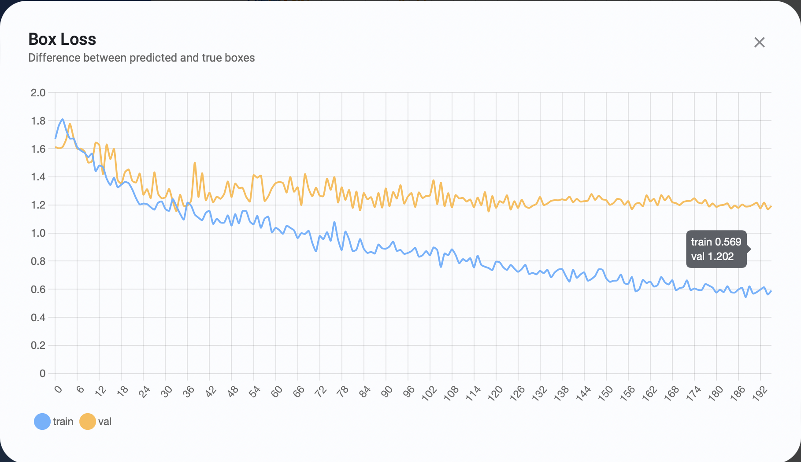

## To Install PyTorch

To install PyTorch, follow the [link to the Pytorch Website here](https://pytorch.org).

Use the terminal command provided by the website. It should automatically change as necessary for the operating system for the computer.

## Using TorchStudio - No Longer in Use

Tutorials for TorchStudio can be found on [their website here](https://www.torchstudio.ai/tutorials/), and their [GitHub is here](https://github.com/TorchStudio/torchstudio).

TorchStudio is an open source software designed to provide a graphic interface (or GUI) for PyTorch and its ecosystem. 

TorchStudio can be downloaded on [their website](https://www.torchstudio.ai/getstarted/); follow the instructions on the page for greater detail.

## Acknowledgement of YOLOv5 and YOLOv5u

```
@software{yolov5,
  title = {Ultralytics YOLOv5},
  author = {Glenn Jocher},
  year = {2020},
  version = {7.0},
  license = {AGPL-3.0},
  url = {https://github.com/ultralytics/yolov5},
  doi = {10.5281/zenodo.3908559},
  orcid = {0000-0001-5950-6979}
}
```

---

<br>

# YOLO Model in PyTorch

Starting May 19th, I was switched to building a YOLO model in PyTorch, specified in TorchStudio, to work on making a hen detection model. I started with using regular bounding boxes, before trying to move into orientations.

## Differences between YOLOv5 to v8

The current plan is to use YOLOv5, but there are newer versions of the program that exist as of recently (May 2023). It may be worthwhile to learn about the newer versions to see what can match up.

Most information below supplied by [dataphoenix](https://dataphoenix.info/a-guide-to-the-yolo-family-of-computer-vision-models/#:~:text=The%20basic%20YOLO%20model%20predicts,at%20155%20frames%20per%20second.), and comparison between YOLOv8 and YOLOv5 supplied by [Augmented Startups](https://www.augmentedstartups.com/blog/yolov8-vs-yolov5-choosing-the-best-object-detection-model#:~:text=YOLOv5%20is%20fast%2C%20easy%20to,popular%20choice%20for%20many%20developers.).

### YOLOv5

The version that is being used, likely v5 in particular. Versions v5n and v5n6 are Nano versions that function for mobile and for CPUs, but since these programs will be running on GPUs on big computers, those will not be necessary.

In Roboflow (a website often recommended by other websites regarding the training of YOLO models, see below for more details), it considers YOLOv5 `popular` when selected for custom models, as it is the version used for most applications, and more known than its successors.

### YOLOv6

Version v6 was designed with hardware in mind: it increases performance by separating layers featuring the heads, rather than keeping it all in one.

### YOLOv7

Version v7 was considered the fastest and most accurate, with the most advanced deep neural network training techniques.

### YOLOv8

Version v8 is the latest version, which is changed by having anchor-free detection heads, and loss functions, among others. It can also run both on GPUs and CPUs. 

Comparing v8 to v5, v5 is considered easier to use, being built upon the PyTorch framework, while v8 is faster and better overall, especially for **real-time object detection** (of which this project will eventually be based upon). For the sake of this experiment, I started with YOLOv5, for it is easier to learn by starting with the more widely known model.

## How to Use YOLO in PyTorch

From the [GitHub for Ultralytics/YOLOv5](https://github.com/ultralytics/yolov5), type into Terminal:

```
git clone https://github.com/ultralytics/yolov5  # clone
cd yolov5
pip install -r requirements.txt  # install
```

To train a dataset for YOLOv5 in PyTorch, I referenced tutorials provided in the above source link.

### Accessing Data from Roboflow

Due to previous tasks in my research projects, I already had data made in Roboflow. If one does not have any models in Roboflow prepared, find one in Roboflow, use [this one made by me](https://universe.roboflow.com/msu-smart-agriculture/hen-data/model/2), or train your own model by [following the instructions here](https://docs.ultralytics.com/yolov5/tutorials/train_custom_data/#12-create-labels).

Go to `Generate` and create a version of the data set to prepare for download. Choose to `Custom Train`, deploy with a selected YOLO model (v5 for this experiment, though v8 is provided as an option). 

If you wish to have the API Key for my Roboflow model: "Jag7chAK7d5GtzYsv4LX", [or use the link.](https://universe.roboflow.com/msu-smart-agriculture/hen-data)

---

# YOLO - Creating and Testing a Training Model for Analyzing Hens

## (10/10 - 10/16, 10/17 - 10/23) - Cropping

This week was alternating between annotations and getting a cropping function to work.

### Image Cropping in OpenCV - Scrapped

To crop an image, first read the image into a variable. Then, when deciding on coordinates, follow below.

To set the boundaries on an image, use:
```
crop = image[y:y+h, x:x+w]
```
`X` and `Y` are the starting points from the top left corner of the image, and `H` and `W` are the height and width respectively. (a:b) corresponds to the starting and end points, where `a` is the start and `b` is the end.

This has since been scrapped for a proper masking tool.

### Masking

To mask an image, use the coordinates (mentioned above) of the top left corner (x0, y0) and the bottom right corner (x1, y1) as a rectangle with inverted colors. Then, use an AND bitmask to clear everything except for the contents inside the rectangle.

```
import cv2
import numpy as np

mask = np.zeros(org.shape, dtype=np.uint8)
mask = cv2.rectangle(mask, (x0, y0), (x1, y1), (255, 255, 255), thickness=cv2.FILLED)

result = cv2.bitwise_and(org, mask)

cv2.imshow("Result: ", result)
```

Notes:
1. `(image).shape` takes the data of an image of OpenCV, under (width, height, channel). This `channel` is unrelated to the actual cameras, but is instead related to the number of color channels (0:3, with 0 channels being grayscale, multiple channels adds Red, Green, and Blue).
2. `dtype=np.uint8` refers to a data type of unsigned 8-bit integers.
3. `thickness=cv2.FILLED` means all sections inbetween the two points.
4. `(255, 255, 255)` corresponds to RGB colors, and thus is all black.
5. `org` is the name for the original image. This is consistent within my code, and is written in shortform for simplicity.

---
<br>

## (9/26 - 10/2, 10/3 - 10/10) - Annotations Galore

As my image processing program was handed off to someone with more experience (to Yunfei, to wit), I continued making annotations in trainYOLO, to hopefully create a good pose model in YOLOv8.

### Changes of Devices

In order to smoothen the progress of annotations, I switched to using my trainYOLO account on my PC rather than my laptop. Having previous experience annotating on mouse and keyboard from having annotated lots of eggs, it certainly sped up the rate at which I could annotate hens.

### Progress Update

With 77 labeled images out of a current 134 images and 2309 objects listed, I have a mAP of 0.916. However, in order to try to predict images directly on the trainYOLO program, I would need to upgrade my subscription (which I'm not going to do because I really shouldn't spend any more money than I have to).

The primary thing inherently holding me back is my odd inability to actually test my models, no matter what methods I try to find.

Models may be updated and placed into a folder (`work/YOLOv8 Images to Data/Hen Analysis`) in GitHub. More images will also be added as time passes if this works out as a good annotation method.

---
<br>

## (9/19 - 9/25) - Coding and Analysis

This week was focused on continuing the program I have created, leaving annotations and making data on the backburner to focus on the end product.

### Streamlined Storage

My first order of business is to handle the storage of images: it is currently being inefficient by storing each image in a set of folders. Locating paths that don't yet exist can be difficult, but it shouldn't be super difficult to convert either.

As an aside, I also added `save_txt = True` to the predict function, which lets me save the labels as a text file, in a series of numbers.

I ended up with this code:
```
#Reorganize images and labels without folders.
path = "/Users/generuan/YOLOv8/Predictions"
files = os.listdir(path)
for index, folder in enumerate(files):
    #Path is /Users/generuan/YOLOv8/Predictions
    #Index starts at 0, Folder starts at img1.jpg
    old_labels = path + "/" + folder + "/labels/image0.txt"
    old_image = path + "/" + folder + "/image0.jpg"
    new_labels = path + "/labels" + str(index) + ".txt"
    new_image = path + "/image" + str(index) + ".jpg"
    os.rename(old_labels, new_labels)
    os.rename(old_image, new_image)
    os.rmdir(path + "/" + folder + "/labels")
    os.rmdir(path + "/" + folder)
```

As long as it is, this was the simplest method I could figure out to simplify my folder of images down to just the images and label data.

Furthermore, I applied an extra layer by sorting these images and labels into two folders, for ease of organization. The code is as follows:

```
#Reset files path (otherwise, it counts above actual number of images.)
files = os.listdir(path)
for file in files:
    #File starts at image0.jpg
    file_path = path + "/" + file
    file_name, file_ext = os.path.splitext(file)
    if(file_ext == ".jpg"):
        shutil.move(file_path, image_folder)
    elif(file_ext == ".txt"):
        shutil.move(file_path, label_folder)
```

It checks the extension of the file by splitting the file name between the period (using the period in the extension part of the string). This can be applied to any type of file-checking code; it currently applies to the `.jpg` images and `.txt` label files.

### Loading a Custom Model

Once again, I get into problems with running the model I have already trained. This time, I've saved myself some headache by using try-except, so that even if loading the model fails, the program still runs as normal. I've also integrated a boolean to check if the trained model loads, so I can use two separate input videos without harming either functional model.

I've also tested it with the regular, non-pose model, and it won't budge.

---

<br>

## (9/12 - 9/18) - Program Analysis

This week had more focus on programming with both the trainYOLO program and separate from it for active analysis.

### Requirements

To reiterate, the requirements for this program are:

1. Input: video data, likely presented as a series of images.
2. Output: processes image data into annotation data.
3. File type: programs use `.pt`. 

### Running .pt Files

I finally found a simple code segment! It works in VSC, it's very simple in code, and can be easily tweaked with little to no problems; it even works with a pose variant of `.pt` files. It will require more tweaking to add videos, but videos are basically a series of images.

The issue still remains: it doesn't currently work with my current type of model. According to the documents and user questions, one must load an *official model* before using a personal model. Even after loading the official pose model first, it still gives me some errors to work out.

[Source is this video by Koby_n_Code.](https://youtu.be/hg4oVgNq7Do?feature=shared)

However, now I have base code that takes an input of a video, and outputs every image per frame, including saving every frame that is getting registered. I also added code that resets the folder used to save the predictions, but this is done for space-saving more than anything, and can be easily turned on and off (perhaps with a `y/n` command program before actively running the program). 

This is good starting code, and now I have references for which to make more accurate code segments. For the current code, confidence is set as `conf=0.01` (the lowest I know to set it), but VideoCapture is set to its default speed. I also added a timer purely to see how much time has elapsed between starting and ending the program.

---

<br>

## (9/5 - 9/11) - Training and Testing

I continued with annotations (until an unfortunate portion, see just below), before moving back to video footage and analysis.

### Locked Out, Cost Exchange

At the end of the week (Friday, 9/8), trainYOLO locked out my access to the account from my free trial. It will not let me access my current data anymore; thankfully, I saved one of the older models before it locked me out, though it is not great due to its data size.


I went ahead and bought it anyways, as I'll make up the cost with no problem. I only bought the basic labeling tool, as I'm unlikely to use the auto-labeling tools with the current set up, as the previous time I used it (see below), it wasn't very good. Even then, I won't need to use it until after I need to test out the program.

The latest model is listed at *0.002* mAP (mean average precision), which is barely functional at best. My current goal is to raise that value greater than 1, then push it as far as I reasonably can. 

---

<br>

## (8/29 - 9/4) - New Data Type, Old Code

This week, I've been tasked to use a new program I found that could use points and bounding boxes, test it, and also try to run video with a model in the meantime.

### Annotation Data

Using `trainYOLO`, I can make a model that should analyze using both bounding boxes and positions. According to the docs, I can use this meager model (15 images to start) to continue annotating more images with the model-assisted labeling tool.


It is apparent that the annotation tool is still relatively bad, but at least it does both poses and boxes as wanted!

With that in mind, I should be able to continue making annotations until it is eventually good enough to use as a normal annotation program. I should also adjust the usual variables (epochs, batch size) to make the training more effective as I add more images to the database.

---

<br>

## (8/22 - 8/28) - New Prospects of Annotations

For the week, I have been tasked with possibly adding additional annotation data, merging bounding boxes and points into my data.

### YOLOv8 - Alternative Annotation Methods

The primary method for annotations in the YOLO format are bounding boxes, squares that tightly surround a target. However, there are alternate methods to annotations that vary in analysis type and method. These are more recent, as these did not appear in previous notes seen below.

**Segment** tightly wraps a bounding area to the object by its outline, rather than a general area. This is probably not necessary, and more tedious than anything, especially on moving objects.

**Track** follows the position of an object with a line along the center of a bounding box. This might be usable further down the line for the object-tracking functionality that is necessary for this project.

**Pose** connects segments by specific dots, in a similar vein to DeepLabCut. Then, straight lines connect each dot as segments. As this is the closest method to DeepLabCut, it may be possible to integrate this method into annotations without altering too much.


Through my search, I found an alternative program, "trainYOLO", that can let me analyze images and create a model using multiple segments, both *keypoints* and *bounding boxes*. However, trying it out, it would require me to reannotate all of the images *again*, as it won't let me upload pre-annotated data at all. Given the size of my current data set, this will take much longer, and it is unlikely I'd have people to collaborate with.

### Printing Outputs

At the current moment, I've been using an output that only prints or writes the numbers received from the program. YOLO itself has a function for outputting the annotations directly onto the images, but that is separated from my current program's functions, and would not work given my source should be completely offline by the end. (At the current state, it does not quite matter, as it is for testing more than anything.)

---

<br>

## (8/16 - 8/22) - Tweaking the Data Set

I finished up annotations, and now it's time to test and tweak it.

### Categories

To streamline the process for using my model, I removed all 47 of my photos with eggs, as they do not contribute much to the *hen* related process. The categories have been reduced to just hens, though I cannot change that for no particular reason in Roboflow.

As an addendum, I still have another 317 images left unannotated in my model. If I ever need more data, I'll start by adding small batches of those rather than searching for new images, as it'll let me get through the process much faster.

### Using a Model

After following the steps through Ultralytics to create a model, I analyzed it through the inbuilt analysis function provided through the "Preview" feature in the website.

```
import json
import requests

# Run inference on an image
url = "https://api.ultralytics.com/v1/predict/MBBxBWqBx5aeu1y7OsRv"
headers = {"x-api-key": "fda4153d4b25ceb5e59cd7d73352443ea175442b83"}
data = {"size": 640, "confidence": 0.01, "iou": 0}
with open("path/to/image.jpg", "rb") as f:
	response = requests.post(url, headers=headers, data=data, files={"image": f})

# Check for successful response
response.raise_for_status()

# Print inference results
print(json.dumps(response.json(), indent=2))
```

This in conjunction with a Python program that can convert videos to image files leads to:

```
import cv2
import json
import requests

vidcap = cv2.VideoCapture('/Users/generuan/Downloads/ch1_0808_1931.mp4')
url = "https://api.ultralytics.com/v1/predict/MBBxBWqBx5aeu1y7OsRv"
headers = {"x-api-key": "fda4153d4b25ceb5e59cd7d73352443ea175442b83"}
data = {"size": 640, "confidence": 0.01, "iou": 0}


def getFrame(second):
    vidcap.set(cv2.CAP_PROP_POS_MSEC, second * 1000)
    hasFrames, image = vidcap.read()
    if hasFrames:
        cv2.imwrite("image" + str(count) + ".jpg", image)  # save frame as JPG file
        with open("/Users/generuan/PycharmProjects/video-to-img-folder/image" + str(count) + ".jpg", "rb") as f:
            response = requests.post(url, headers=headers, data=data, files={"image": f})
            # Check for successful response
            response.raise_for_status()

            # Store inference results
            with open('/Users/generuan/Library/Mobile Documents/com~apple~TextEdit/Documents/test_analysis_1.txt', 'w') as w:
                w.write("image" + str(count) + ".jpg")
                w.write(json.dumps(response.json(), indent=2))
                w.write('\n')
    return hasFrames


sec = 0
frameRate = 0.5
count = 1
success = getFrame(sec)
while success:
    count = count + 1
    sec = sec + frameRate
    sec = round(sec, 2)
    success = getFrame(sec)
```

This code is rudimentary at best, but gets the job done for a simplistic video-to-image simulator.

However, this program produces over 200 images even in a video that is 1:51 in length, and thus force-stops itself due to putting too many requests into the model at once. That can be changed by fiddling with the frame rate, but it also may come up when dealing with live cameras. 

The output looks like this (cut down due to size):

```
image10.jpg{
  "data": [
    {
      "box": {
        "x1": 769.7968139648438,
        "x2": 989.7529907226562,
        "y1": 99.56735229492188,
        "y2": 320.3623352050781
      },
      "class": 0,
      "confidence": 0.8815011382102966,
      "name": "hens"
    },
    {
      "box": {
        "x1": 541.2265625,
        "x2": 699.3667602539062,
        "y1": 533.9769287109375,
        "y2": 811.2401733398438
      },
      "class": 0,
      "confidence": 0.8645486235618591,
      "name": "hens"
    },
    {
      "box": {
        "x1": 823.8176879882812,
        "x2": 954.1950073242188,
        "y1": 299.71502685546875,
        "y2": 538.8759155273438
      },
      "class": 0,
      "confidence": 0.8556870222091675,
      "name": "hens"
    },
  ],
  "message": "Inference complete.",
  "success": true
}
```

A current issue I'm finding with this code is that it *only* writes image 10, even though there are nine other images before it. Turns out, it is *overwriting* the other entries, even though it shouldn't.

### Addendum: Data - Metrics and Loss Graphs

Below are the different metrics and loss graphs, as created by Ultralytics.


---

<br>

## (8/9 - 8/15) - Updating Annotations

There are more cameras, and more types of data to be done. Most of the current data focused on large gatherings of hens in one space, due to needing data from overlaps.

### New Camera Data

A batch of 8 cameras were added, and as such, another 32 images were added to my database (4 images per camera). These frames are slightly different than the rest, as there are multiple layers in each aviary, so hens usually overlap one another.

### Types of Data

The model requires a variety of different annotated image types: at the moment, I have regular hens and small groups of hens, but I've yet to properly annotate lots of hens in one space ("clusters"). As such, my next batch of annotations included lots of hens packed into small spaces (which may be difficult to find).

The general criteria I used is that if there are at least five hens in one area of the frame, I'll use it for annotations. The easiest place to locate this with the new batch is the raised area in the center, where hens are either on top of the grates or underneath, but I did use other areas with big groups. 16 images were added to the annotation space, but more may be added at a future date for more accuracy.


### Annotating Clusters

Since trying to *accurately* annotate a cluster of overlapped hens would take too long, the attitude boiled down to just doing the best I could in a reasonable amount of time. 

Some hens are very visible, generally on a layer closest to the camera relative to the other hens. The others that are underneath are mostly guess-work, with little to base off other than a head or a tail. Multiple bounding boxes completely overlap another.

---

<br>

## (7/31 - 8/8) - Refocus on Progress

After having functional progress in the previous week, I continued to expand on that.

(Due to changes in meeting dates, this week was expanded to encompass two Tuesday meetings, 8/1 and 8/8)

### Using my Model

The current tests work with the pre-trained models of YOLOv5, but I need to use my own model (or any other models we can use). At the current state, it causes a problem due to not being trained under YOLOv8 architecture, for which the newer versions of the v5 models have already been updated.

Downloading the model straight from Roboflow as either a v5 or v8 model doesn't work: the former is not forwards compatible, and the latter won't train under the code provided by the YOLOv5 tutorial. It is possible to use the `predict` command to run models with certain architectures, but that cannot be easily implemented as functions.

The other recommended method is to retrain a properly sized model with the YOLOv8 Architecture (as specified previously, the yolov5(x)**u**.pt variants are updated versions of the originals with the new architecture).

By changing the train command to run as:
```
# Train YOLOv5s on COCO128 for 3 epochs
python train.py --img 640 --batch 16 --epochs 3 --data coco128.yaml --weights yolov5su.pt
```

It should be possible to train the model (coco128.yaml in this example) to YOLOv8 specifications. This does not work on its own: it simply tells me that this model does not exist.

### Another Change of Plans

Being informed that the entire previous progress from last week is not what was in mind for the project, I have to refocus attention again on something different: this aspect of the project is to reconfigure the given YOLOv8 (previously YOLOv5) program to run a specific model, neural networks, and different cameras.

### Annotations

With a new set of cameras to be tested, I began annotating as usual through Roboflow, using a set total of 32 images (4 per camera, 8 cameras), which are slightly different but should be similar enough to not matter as much in regards to the full data.

Annotation Notes:
1. Hens that are partly cut off by the limited capture size of the screen are still annotated as hens.

2. Hens underneath grates, poles, and other architecture are annotated to the best of my ability, mostly tracking head and tail and going from there.
3. Hens sitting outside of sectioned aviary are not annotated, even if visible. Either way, it should not matter if those hens on the outside are given bounding boxes, as they will be captured by another camera anyway.

---

<br>

## (7/24 - 7/28) - Returning to Roots

This week is returning to the roots, upon being told that I was looking much too far into coding, instead of starting with the basics and the tutorials.

### Inference

To start, I needed to test that the inference code would work as normal, beginning with the code below, taken directly from the YOLOv5 GitHub.

```
import torch

# Model
model = torch.hub.load("ultralytics/yolov5", "yolov5s")  # or yolov5n - yolov5x6, custom

# Images
img = "https://ultralytics.com/images/zidane.jpg"  # or file, Path, PIL, OpenCV, numpy, list

# Inference
results = model(img)

# Results
results.print()  # or .show(), .save(), .crop(), .pandas(), etc.
```

The code `torch.hub.load()` follows these parameters:

```
(repo_or_dir: Any, model: Any, *args: Any, source: str = 'github', trust_repo: Any | None = None, force_reload: bool = False, verbose: bool = True, skip_validation: bool = False, **kwargs: Any) -> Any
```

Once again, I had to ask online, because every time I tried something different with this ***first*** command, I get errors due to the program being unable to find the repository or directory. I also cannot skip this command, as getting the model to load is required for the rest of the program to function.

### Actual Progress

I have managed to make a test code that runs one of the pretrained models with one of my images, to load in data. While I cannot get it to load an image, that won't be necessary for the task I've been given. It also really didn't work in Visual Studio Code, but PyCharm is close enough as an IDE for `.py` files.

Now, I need to run the model I have, which requires training it elsewhere. Google Colab allows for downloading trained data sets, so I used its tutorial for a simple way to train a large dataset.

For this one, I use a completely different function than above, aptly:

```
from ultralytics import YOLO
model = YOLO(''yolov5nu.pt'')
```

However, when using a `.pt` file that isn't based in YOLOv8 (the YOLOv5(x)**u** files are updated files of the originals that are wrapped in YOLOv8 architecture), it does not work, giving an error detailing that the file is not *forwards-compatible* with YOLOv8, even though both use the same backbone architecture.

Trying to do the same training in Google Colab with a YOLOv8 model runs a similar type of error due to incompatibility.

---

<br>

## (7/17 - 7/21) - Project Management

This week is continuation of the Python coding, but with proper work, as the last two weeks were mainly research based rather than coding.

### Importing Roboflow Data

As the previous method of active code was not giving me good results, I opted instead to import the data manually using the Export function from Roboflow.

When downloading the data taken straight from Roboflow, it provides folders with testing, training, and validation data, as sourced by the ratio of the images to their respective sections. These can be used to train and validate data.

It also comes with the `.yaml` file of which the model runs from, but I have yet to understand where I can use that in a way that doesn't fail on me.

### Precursory Preparation

To begin, I followed a bit of the original Colab code to see what libraries I'd need and where I'd be able to make do. The primary issue remains, being that Colab runs in `.ipynb`, and Python typically runs as `.py`, meaning the two coding formats do not align.

Running a model requires loading up said model first, acquiring the preemptive baseline used to run all of the other models.

[I found a tutorial that actually uses VSCode](https://www.youtube.com/watch?v=3wdqO_vYMpA), as all of the others use Google Colab. I will be referencing it below.

The above video and GitHub link provides a baseline model that can analyze a YouTube video. The issue is that I'm having problems loading this YouTube video, due to the required library `pafy`. I tested a bunch of sources (downloading `youtube-dl` with it, loading into a specific Python subfolder, etc.), but none of them seem to work.

If this were to work, I'd be able to run videos. If this doesn't work now, I may need to use it at a later time anyways, as videos can be used to more easily test a model, as well as run it like the real deal.

### Change of Operating System

Finding very little progress running in Mac, which has very little references for beginners, I began doing all of the processes to begin coding in Windows, which is its own set of challenges.

Terminals in Windows, for some reason I cannot explain, do not use `git` as a normal function, unlike MacOS. As such, I've put a large number of additional steps just to begin running GitHub, PyTorch, and YOLOv5.

In summary:
1. Download GitHub.
2. Download the Ultralytics/YOLOv5 Directory from GitHub.
3. Download NVIDIA CUDA, Python, PyTorch.
4. Repeat all over because I put it in the wrong terminal (Powershell instead of the inbuilt command terminal).

---

<br>

## (7/10 - 7/14) - Python Coding, Continued

Further continuation of transferring Colab practice into Python scripts.

### Cloning the Git Repository

To begin, there are some steps, starting with getting the repository of the requisite GitHub (particularly YOLOv5 in Ultralytics). 

[This link is a tutorial for MacOS (which I use).](https://learn.microsoft.com/en-us/visualstudio/mac/set-up-git-repository?view=vsmac-2022)

While using this tutorial, I was instead ushered into GitHub Desktop, an app that acts as GitHub but not web-based. It merely acts as a portal to use GitHub and save repositories, before loading an coding software, externally using VSCode in this case.

### Installing Roboflow

Roboflow allows for externally importing the dataset through Python and an API key to upload the dataset into the program for easy testing and training.

[A blog by Roboflow was referenced for this section.](https://blog.roboflow.com/pip-install-roboflow/)

(Source: Active Learning Conditionals code from source above, with comments regarding paid content removed)
```
from roboflow import Roboflow
# obtaining your API key: https://docs.roboflow.com/rest-api#obtaining-your-api-key
rf = Roboflow(api_key="INSERT_PRIVATE_API_KEY")
workspace = rf.workspace()


raw_data_location = "INSERT_PATH_TO_IMAGES"
raw_data_extension = ".jpg" # or ".png", ".jpeg" depending on file type

# replace * with your model version number for inference
inference_endpoint = ["INSERT_MODEL_ID", *]
upload_destination = "INSERT_MODEL_ID"
# set the conditionals values as necessary for your active learning needs
conditionals = {
    "required_objects_count" : 1,
    "required_class_count": 1,
    "target_classes": [],
    "minimum_size_requirement" : float('-inf'),
    "maximum_size_requirement" : float('inf'),
    "confidence_interval" : [10,90],
}

workspace.active_learning(raw_data_location=raw_data_location, 
    raw_data_extension=raw_data_extension,
    inference_endpoint=inference_endpoint,
    upload_destination=upload_destination,
    conditionals=conditionals)
```

The same tutorial advises adding `pip install roboflow` whenever the code should systematically collect images, but doesn't elaborate further with any ideas other than "logic". However, this "logic" may likely include code that feeds the images into the program and any alterations necessary to fit the image to the specifications of the model.

NOTE: This does not seem to work, but the alternative of using the raw data file extracted from downloading the data of Roboflow may work instead.

### Training in Python

Training is an interesting section, considering that it may require further external requisites in order to start. 

[Notes for training are referenced from the Model Ensembling docs of Ultralytics.](https://docs.ultralytics.com/yolov5/tutorials/model_ensembling/)

According to this document the `train.py` and `val.py` segments are given by the base YOLOv5 program, like so:

```
git clone https://github.com/ultralytics/yolov5  # clone
cd yolov5
pip install -r requirements.txt  # install
```

However, this code seems to overlook the premise of not using Google Colab to train models, as all of this is featured in Google Colab with most of the work already done. This may work, but requires further testing and troubleshooting.

---

## (7/3 - 7/7) - Python Coding

Continuation of transferring Colab practice into Python.

### IDLE to VSC

IDLE is a basic integrated development environment for Python that's supposed to be suited for beginners, while Visual Studio Code (VS Code, or VSC, for short) is a more general source-code editors that can utilize a variety of programming languages.

`.py` files can be used in both programming languages, though by default, IDLE is selected over Visual Studio Code. However, when opening the file straight into VSC, it runs an error due to the differences in formatting. In particular, it's the `!(command)` formatting that messes with the program the most.

It gives an error `Invalid character "\u21" in token Pylance` for the exclamation point `!` in particular, and highlights the signs `&&` and `--` as likely errors as well. Running the program gives me `Syntax Error`, and removing the `!` gives additional errors due to commands being undefined.

### New Program with Understanding

With failed attempts to use the prewritten instructions, I moved onto the back-up plan: writing my own document that utilizes some parts of the code to make the end product. This may follow the structure of the aforementioned document, but will apply to Visual Studio Code rather than IDLE, and be made in something that I actually can understand without a problem.

1. `!git clone`

The command `!git clone` is used to grab the Ultralytics YOLOv5 data from GitHub, to use as a baseline: gathering the models and weights to use for training and testing. Instead, I can open a GitHub repository into VSC, and use that to run in my model, rather than bothering with commands that don't seem to work. 

2. `!pip install roboflow`

Roboflow is necessary only for the data and premade model it provides. However, I need some form of data in this project, and thus the input is required. The `!` character is likely only required in the `.ipynb` file format, as that one is web-based, and thus must download Roboflow on each instance. In this case, it can be omitted here, and used in Terminal, as long as the Roboflow packages end up connected to the program.

3. `!python detect.py` or `!python train.py`

Again, it's likely the `!` character causing problems. Training should work just the same as it does in the Colab doc, the indicators of the training should occur in the in-built terminal. (UNTESTED)

---

<br>

## (6/28 - 6/30) - Transitioning to a Proper Python File

Work in Colab is entirely for learning, as the nature of it does make it difficult to run through external means. Thus, whatever work done in Colab could be altered to work in a regular Python (`.py`) file.

### Colab to Python

Colab files provide an option to download either in `.ipynb` or in `.py` format. Downloading in `.ipynb` gives an identical file in Visual Studio Code, and downloading in `.py` format gave me a file in IDLE.

There are also commands for converting a Google Colab file into a Python script. [Here is the page on the command](https://pypi.org/project/colab-convert/), but to summarize:

A Colab file can be downloaded as an `.ipynb` file ("Interactive Python Notebook", the standard for Jupyter Notebook and Colab), which by using certain commands of `colab-convert` can be converted into `.py` and vice versa.

### Necessary Data

Since certain external files are no longer connected via database, they need to have their own external data supplemented instead. 

Files that get implemented as part of the process: <br>
* A cloned base data set of YOLOv5, based from website
* My uploaded data set from Roboflow, based on API
* Base YOLOv5s weight for training, also based on initial website

Files that were not included and needs to be supplemented:
* The customized data file that gets used to train and run, based on my code
* Test files, due to being last effort and only after the model is trained

I added all of the collective files for my new test files into separate folders, the only differences between the two being the format of the file being used as training.

(Note of week): if neither method seem to work as I had iniitally considered, I will write my own program built on parts of the code provided through the Colab learning experience, and code I write up to make it easier to run or use.

---

<br>

## (6/26 - 6/30) - Colab Work

This entire week is spent on tweaking a Colab file to be used for analyzing data. See the instructions below in (6/12 - 6/16). This block is in regards to any changes or analysis to be made from working on it.

NEW Consensus: Sometimes, Colab does save. However, while its function makes sense (being connected via files into the computer), the manner at which it does so feels inconsistent.

Previous Consensus: Every time a Colab file of documents is reloaded, it does not save any of the data, only the code segments. As such, each test must be preceeded by running each individual code segment, and adding each necessary file, no matter what. As such, attempts and changes must be pre-planned to avoid spending too much time running code and training.

### Testing the Program

The initial code segment for the Addendum code looks as follows:

```
# YOLOv5 PyTorch HUB Inference (DetectionModels only)
import torch

model = torch.hub.load('ultralytics/yolov5', 'yolov5s', force_reload=True)  # yolov5n - yolov5x6 or custom
im = 'https://ultralytics.com/images/zidane.jpg'  # file, Path, PIL.Image, OpenCV, nparray, list
results = model(im)  # inference
results.print()  # or .show(), .save(), .crop(), .pandas(), etc.
```

With how it reads, it is not easy to tell how to change what to make it work.

Any attempts to change the model or the 'im' variable leads to FileNotFoundErrors, even if I include the path and insert the document into the internal files of the Colab doc. The given image is referenced in the document itself, but isn't remotely associated to the project, being two humans and zero hens.

The `.print()` statement prints out a few lines stating the statistics of the model analysis on a given image, but doesn't print anything associated with the image itself.

`.show()` gives the actual image with annotations, bounding boxes and accuracy included.
`.save()` saves the same image as in `.show()` to the "detect" subfolder in the "runs" folder, rather than actually showing it in the document.

`.crop()` gives the coordinates of the bounding boxes of the image, as well as saving a pure copy of the image (no annotations) in a folder in "detect". 

`.pandas()` gives a list of coordinates based on the pandas library, as seen in [this example from PyTorch Hub](https://docs.ultralytics.com/yolov5/tutorials/pytorch_hub_model_loading/#force-reload):

**(EXAMPLE TEST, NOT PERSONAL DATA)**
```
import torch

# Model
model = torch.hub.load('ultralytics/yolov5', 'yolov5s')

# Image
im = 'https://ultralytics.com/images/zidane.jpg'

# Inference
results = model(im)

results.pandas().xyxy[0]
#      xmin    ymin    xmax   ymax  confidence  class    name
# 0  749.50   43.50  1148.0  704.5    0.874023      0  person
# 1  433.50  433.50   517.5  714.5    0.687988     27     tie
# 2  114.75  195.75  1095.0  708.0    0.624512      0  person
# 3  986.00  304.00  1028.0  420.0    0.286865     27     tie
```

### Analysis of Code

The code `torch.hub.load()` uses the parameters:

```
torch.hub.load(repo_or_dir, model, *args, source='github', trust_repo=None, force_reload=False, verbose=True, skip_validation=False, **kwargs)
```

Most of these parameters can be overlooked, as they're optional, except for directory, model, and source. In this instance, source must be set as `source='local'`, to ensure that the directory properly attaches itself within the Colab file. As the default is set to `source='github'`, this may be the source of the FileNotFound errors, as it may be trying to search for a file that does not exist.


---

<br>

## (6/19 - 6/23) - More Data

I have less to talk about most of this week, as most of it was spent annotating data in Roboflow to have more data. More data leads to more accurate models, but I do have things to say about how my annotation style has changed, and my next steps.

### New Procedures

In the previous annotation data (81 images total), I've neglected some dense images due to time. Now that I have more time, I can spend more of it working on images with more hens at once. 

Also, now that I have more annotation expertise, I can now recognize whether hens are one or in clusters of multiple, often due to overlaps and similar lighting and shadows that make them harder to separate. Generally, I can now point out a faint line separating these overlapped hens; due to the prospect of the project, overlaps are good data as it will help in fleshing out a test model with confidence 0. 

(Current Progress as of 6/22, 3:57 PM: 136 registered annotated images)

### Continued Progress

I also did do some further progress towards creating a model that can utilize the data as I explained below in (5/31 - 6/2).

I began by creating a new model using the additional annotations I made as outlined above. 136 registered images, using base model YOLOv5s6u, along with the standard settings (reference 5/22 - 5/26).

Upon reinspection of both the tutorial YOLOv5 training referenced below and the Ultralytics automatic model, it appears as though they are in fact the same method; the former has more steps such that one can understand the process, and the latter is done to be as simple as possible for those needing to quickly create a new model.

For my work, I am analyzing more into the former method, a repurposed tutorial, to see where I can make a model work. See the instructions below for further instructions, under "Using Google Colab".

---

<br>

## (6/12 - 6/16) - Alternative Training

Instead of looking at the current applications provided by the group behind Ultralytics, I looked elsewhere for options on training, particularly through other online resources like YouTube.

I ended up finding a few videos that aided me on the subject.

Video 1: ["YOLOv5 training with custom data" - DeepLearning](https://youtu.be/GRtgLlwxpc4)

In the above video, they use a different annotation program, a website called "makesense.ai", and end up with a similar type of data. Fittingly, their example data is hens, though annotated as "chickens" rather than the currently used "hens". 

The aforementioned website allows for annotations (bounding boxes) made in the program to be exported directly in YOLO format, similar to Roboflow. I find it unlikely that I'll be required to use it as well, but I may change my mind later.

The real section of the video above involves the Google Colab training, its source being the Google Colab document in the YOLOv5 GitHub page. Using Google Colab means that one can train a model with external GPU or CPU, without needing to tax into their personal computers.

I also used a given tutorial by Ultralytics themselves in their docs to see how I can train custom data through this method. Linked here, as [Train Custom Data](https://docs.ultralytics.com/yolov5/tutorials/train_custom_data/).

### Using Google Colab - CURRENTLY UNTESTED

NOTE: As of this document being uploaded, it has been untested in visualization. I do not have any instructions related to visualizations of the data, but I am working on it.

UPDATE: Repeat tests work fine. This instruction document is as needed, though the video above is a good source for visual representation.

In Google Colab, I can run a basic YOLOv5 program to see how my data currently forms.

In general, the Google Colab document found below has its own tutorial. This tutorial can be followed using other sources of data, sourcing Roboflow as a primary example (due to Roboflow being a first-party program).

How to Create a YOLOv5 Model with Google Colab (Initial Steps):
0. Create a data set that uses YOLO format. The video uses a separate website called "makesense.ai", but provides a similar file to that found from Roboflow.
1. Open the [Google Colab file here](https://colab.research.google.com/github/ultralytics/yolov5/blob/master/tutorial.ipynb) from the GitHub. If you'd wish to keep it, save a personal copy into your Google Drive. This will be the baseline used to make a model.

2. Hit the "Connect" button to connect your Google Colab file to your computer. 

3. Run the Setup cell, to obtain the YOLOv5 program on the file. Open the YOLOv5 Folder that appears on the side, under the Files side tab. Upload the data set into the Files side tab. Make sure it is in zip format (otherwise, make it a zip file). 

4. Add a new code segment, and run the below command. This command takes the data from my workspace of data, and inputs it into the files.

```
!pip install roboflow

from roboflow import Roboflow
rf = Roboflow(api_key="Jag7chAK7d5GtzYsv4LX")
project = rf.workspace("msu-smart-agriculture").project("hen-data")
dataset = project.version(5).download("yolov5")
```

(The API Key above is from my dataset in Roboflow. As it is based in the research that is built to be shared around those who'd have this document anyways, I have no qualms against posting it here.)

5. Open the YOLOv5 folder, then the "data" subfolder, then download the "coco128.yaml" file. Open the file and edit it to match the number of classes and class names of the given data set. Change the path names of the train and valid variables to match the path files associated with the new data set. Upload the finished file back into the "data" subfolder, inside the "scripts" folder.

6. Run all of the other code cells to begin training the data, changing code to fit as necessary. Alter the training code segment as follows:

```
!python train.py --img (size of image) --batch (number of iamges analyzed per trial) --epochs (number of trials) --data (name of dataset).yaml --weights (weight) --cache (type of cache, ram or disk)
```

For instance, my example for this, using a dataset named "custom_data.yaml" is:

```
!python train.py --img 640 --batch 16 --epochs 3 --data custom_data.yaml --weights yolo5s.pt --cache
```

(Note: Cache is set to blank, but assumed RAM.)

6. Use the Addendum cell at the very bottom to see how the model works. (Instructions pending)

---

<br>

## (6/5 - 6/9) - Model Connections

This week was spent on writing and analyzing a process to connect a model to an external data source for analysis. Last week's research was partially spent on analyzing how YOLO as a model works (see the 5/31 - 6/2 time stamp below), so this week will be expanding on that knowledge.

### The End Goal

For the end result of the project, the output has a few requisite behaviors:

1. The confidence value (dictated by the score variable) must be irrelevant to the outcome. Below is an example from Roboflow with the confidence threshold set to 0%.

2. It utilizes a time interval of 1 second, with camera function assumed to be at 15 frames per second: essentially, a program that is capable of seeing 15 frames at any one time.
3. Can store the density value of each annotation: each annotation is framed within a 40x40, 80x80 or 20x20 file size. 
4. All steps of the function should be activated in one command.
5. It should be easy enough to understand for future work.

### Part 1: Confidence Value

The confidence determines how certain the model believes that a given predicted annotation matches with surrounding data of its class, on a scale between 0 and 1, rounded by the hundredth digit. YOLO has a parameter, listed as `confidence threshold` in the source code, and for this experiment, it will be set to 0% (or 0 or 0.00), such that every value should be listed.

### Part 2: Interval and Images

The model will compare 15 frames per second to see how hens move and when they lay eggs. Since a YOLO model itself will only take one image at a time, this boils down to how the program will be receiving input, likely from a frame-by-frame format (input and run for each frame that gets created by a camera).

### Part 3: Density of Images

Each image can be framed within a 40x40, 80x80, or 20x20 file size, relative to the original size of the image. This is typically done within the model, but for the sake of this process, it must be kept before it is finalized as one set of data.

### Part 4/5: Simplicity for Future

For easy work in future projects, the program must be made easy to understand, and functions in just one command, rather than having to fiddle with other processes just to use it. 

As such, there will be one program of which one command runs the entire model with necessary steps, and if necessary, I may add a side document explaining every additionally necessary detail within the program for reference and ease of usage.

### Code Confusion

A primary issue I'm having in writing code is that I cannot find a method that allows me to read what is inside the code of the model. The typical method for loading a file in PyTorch (TextEdit, a text writing software for Mac, or loading it into Visual Studio Code) will either fail to open due to probable corruption or strange characters (the former, TextEdit), or will load but not in proper text anyway (the latter, Visual Studio Code).

This leads to me being unable to understand how to properly input data, as I do not know how the format works, both in PyTorch files in general and with the specific model type. 

### Exporting Files from Roboflow

The beginning of the problems stems from the original program I had used, Roboflow. While it was good to begin using, it led to multiple technical problems due to some lack of organization regarding end products and exporting data.

In each annotated image from Roboflow, it does provide the raw data in code format, including the annotations, in a labeled format that matches the format for other YOLO annotations:

(Example taken from one image containing exactly one egg.) <br>

```
{
    "boxes": [
        {
            "label": "eggs",
            "x": "1465.31",
            "y": "561.91",
            "width": "39.34",
            "height": "48.42",
            "color": "#FF00FF"
        }
    ],
    "height": 1080,
    "key": "ch2_0808_2030_mp4-102.jpg",
    "width": 1920
}
```

However, taking this individually would mean copying and pasting such data for 81 images, with a varying number of annotations per image. Not a terrible task given the actual size of the data (and an already present copy-paste function), but it isn't scalable for much larger sizes of data.

<br>

Thankfully, I did find a simpler solution later: when downloading the files for the dataset in any format, it provides extra folders for the test, train, and validation images; each of these folders contains a folder of the text files of the annotations along with a folder of each of the respective images. 

Images are in .jpg format, likely based on their original formats or ones that are easily recognized by its respective program (I made ones in YOLOv5 and v8, and both were in .jpg format). Labels are text files, consisting of eight numbers and the label.

Example taken from one of my image data files.

```
164 291 226 291 226 357 164 357 hens 0
156 184 204 184 204 281 156 281 hens 0
171 138 233 138 233 196 171 196 hens 0
198 93 241 93 241 182 198 182 hens 0
248 74 306 74 306 133 248 133 hens 0
288 70 357 70 357 133 288 133 hens 0
311 40 373 40 373 94 311 94 hens 0
252 132 293 132 293 232 252 232 hens 0
224 215 269 215 269 322 224 322 hens 0
280 209 362 209 362 276 280 276 hens 0
375 207 437 207 437 273 375 273 hens 0
361 292 437 292 437 338 361 338 hens 0
409 252 456 252 456 327 409 327 hens 0
449 259 501 259 501 313 449 313 hens 0
422 166 463 166 463 220 422 220 hens 0
448 137 503 137 503 199 448 199 hens 0
```

This above format is slightly different than other formats present in YOLO annotations, very likely meaning the coordinates of the bounding box (top left, top right, bottom right, bottom left), and then the category at the end.

I also attempted it using the Multi-Label Classification under CSV, and instead got a result with a .csv file and its images, in a manner similar to DeepLabCut data (which I was having trouble previously due to the organization of the files):


(The columns are spaced as oddly as they are due to the delimiters being used that may or may not be compatible in my current workspace, and also likely due to there being very few subject types.)

<br>

Lastly, I attempted using the COCO option under JSON, with this result below:


---

<br>

## (5/31 - 6/2) - The Core YOLO Process

Progress related to using programs like TorchStudio was scrapped. Instead, focus is changed to writing a script that can easily utilize the model I created originally, input image/video data, then output feature vectors that describe the annotations inside the images.

### How YOLO works

This example is based in YOLOv5, as there is an example model structure in the [documentation seen here](https://docs.ultralytics.com/yolov5/tutorials/architecture_description/#1-model-structure). Information is also provided by [this page on TowardsAI.net](https://towardsai.net/p/computer-vision/yolo-v5%E2%80%8A-%E2%80%8Aexplained-and-demystified). 


1. Input, Backbone:

When a YOLO model acquires an input image, it runs it through the backbone of the model, used to extract the important, informative features of the image. 

The backbone takes the image, and expands it with more categories and larger size, separating one image into multiple sections for which a model can analyze. Each function uses a format that dictates the size of the image and the number of categories in said image: (height, width, category), denoted as "h x w x c".

2. Processing, Neck:

Each subsection of images (40x40, 80x80 and 20x20) is processed by a given YOLO model to analyze and predict the locations of annotations in images, completed with category. 

YOLO processes data into a Feature Pyramid Network (FPN for short). Feature Pyramid Networks are layers of maps that formulate the information of images regarding object detection and succession from the object detecting function.


Information is provided from [this article](https://jonathan-hui.medium.com/understanding-feature-pyramid-networks-for-object-detection-fpn-45b227b9106c): FPNs use multiple layers of image maps to reconstruct and formulate a list of annotations based on different resolutions of the image, downsampling and upsampling as part of the formula. Lateral connections between layers and feature maps are added afterwards, to help predict locations better, as downsampling and upsampling can harm the precision of the model.

3. Output, Head:

After collecting all of the data from the above processing, the model organizes it into a spreadsheet composed of the following format: (category, x, y, width, height, score).

The category is the number related to a list found within the model data, from 0 to the total number
Values x and y denote the starting position of the bounding box, taken from the center values of the box. 

Width and height are exactly as it says, encompassing the entire bounding box based on the central location of the x and y values.
The score is the estimated confidence of the annotation, based on how well the model believes it is accurate compared to other data.

This output is formed for every bounding box present in the image, with each image getting its own set of data. 

---

<br>

## (5/29 - 6/2) - New Developments

This week, I spent some time to look further into the processes behind YOLO training, to see where I can use the programs to get what I need.

### Looking Online

Once again, I asked a GitHub discussion forum: this time (question posted 5/30 around 3:00), it was in Ultralytics in relation to uploading to TorchStudio, the main issue of which I'm finding difficulties.

### Rereading the Docs

(5/30): Upon rereading the main documentation for TorchStudio, I realized that I've misunderstood TorchStudio as its own program, rather than a software that loads PyTorch programs. As such, it shouldn't be as difficult to follow along with the documentation, as it loads the file path of a dataset, and uses it to simulate a model.

(5/31): I stand corrected, the above sentiment is no longer valid.

I followed along with the webpage of the [TorchStudio custom datasets tutorials](https://www.torchstudio.ai/customdatasets/):

My folder created through Roboflow contains the following items:


The last two folders are named "train" and "valid", and these two can be used in TorchStudio's training parameters. In each folder is the images and their respective label data.

Unfortunately, while Ultralytics itself provides a single file exported in ".pt" or one of the other formats, it doesn't provide a set of folders. As such, TorchStudio does not work with just the file from Ultralytics, as it cannot directly load the file or take it as input. 


Each time I attempt inputting the files, I get the same exact resulting error. There are very few documentations regarding this issue.




(The third image is *not* my input data, but rather an example dataset from which TorchStudio recommends, and one that *should* work theoretically.)

---

<br>

## (5/22 - 5/26) - First Impressions

I began by looking into the different programs utilized for YOLO training. This helps to provide a basic list of tools for future use with the trained models. 

## Ultralytics HUB - Training Models

Researching about training and deploying models of YOLOv5 or YOLOv8 leads to *Ultralytics HUB*, a platform developed by the same team as the YOLO systems to easily and quickly train models.

Ultralytics connects to a Google Colab document that allows for training new models without affecting the current operating system. I began by testing out a few model types, adjusting each variable to see what they do.

<br>

### Info taken from the advanced options in the Training tab:

**Epochs**: the number of passes, or trials, taken throughout a database. Increased numbers lead to longer wait times, but more accurate results. By default, it is set at 100.

**Image size**: the size at which a model uses to train data. Larger sizes are more accurate, smaller sizes are faster. By default, it was set at 640, but that may be due to the image sizes (I was testing with a model that used 640x640 scaled images).

**Patience**: the number of epochs at which a model may prematurely stop if it begins to detect little improvement. Higher numbers lead to longer waiting, smaller numbers may cut off the training early to reduce training time. By default, it is set at 100.

**Cache Strategy (None, RAM, Disk)**: If resources allow it, the training may move itself to the RAM or Disk space to speed up the training. By default, it is set to RAM.

**Device (GPU, CPU)**: Sets whether the GPU or CPU will be used for training. By default, it is set to GPU, with CPU being slower and only if GPU is unavailable.

**Batch Size (Auto, Custom)**: may set a certain number of images in batches for purposes in training, with larger batches making smoother gradients and faster training. By default, it is set to Auto, enabled to maximize utilization and minimize time spent.

<br>

### Training a Proper Model

After trying a few models with the default settings, I opted to change a few of them to get a better, more accurate model, first with the following settings, using model YOLOv5s6u:
(Epochs: 300, Image size: 640, Patience: 100, Cache Strategy: RAM, Device: GPU, Batch Size: Auto.)

I made this with the model I had created using Roboflow to start with (81 labeled images of hens), and allowed the computer to build the rest. Below are the results.





Below is an example image taken based on the preview option in Ultralytics. 


<br>

### Exporting Data

Ultralytics allows two methods for applying a model: offering the mobile app (which would be helpful for in-world data, but does not apply much to this situation), and exporting the data as one of many file options.


I have now run into a problem: Ultralytics HUb exports files in '.pt' format, but TorchStudio does not directly support this file type. According to the [docs for Ultralytics regarding custom data](https://docs.ultralytics.com/yolov5/tutorials/train_custom_data/#local-logging), it supports exporting to TensorFlow, ONNX, and other formats, but not specifically TorchStudio.

Searching online, not many sources feature TorchStudio tutorials and tips, possibly because it is relatively newer in comparison to other popular programs and content (2022 release). 

The PyTorch format itself is available on other platforms, with VSCode and PyCharm being my focus in particular (primairly because I already use these platforms, including VSCode used to write this very document). TorchStudio also has some availability to switch or export to other platforms: VSCode, PyCharm, Spyder, and Sublime Text (the only one of which I haven't used before).