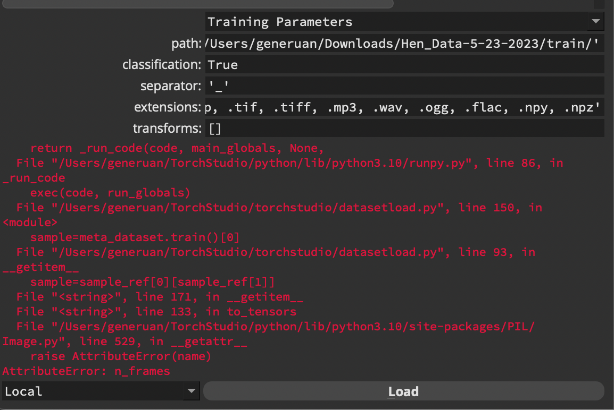
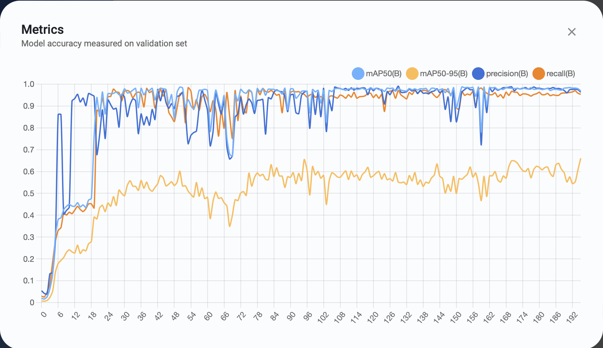
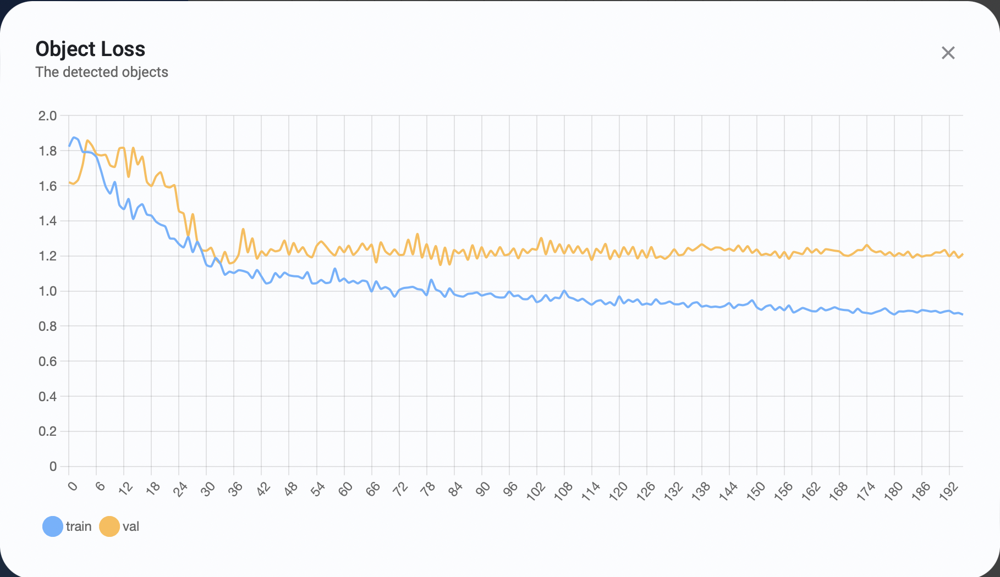

## To Install PyTorch

To install PyTorch, follow the [link to the Pytorch Website here](https://pytorch.org).

Use the terminal command provided by the website. It should automatically change as necessary for the operating system for the computer.

## Using TorchStudio - No Longer in Use

Tutorials for TorchStudio can be found on [their website here](https://www.torchstudio.ai/tutorials/), and their [GitHub is here](https://github.com/TorchStudio/torchstudio).

TorchStudio is an open source software designed to provide a graphic interface (or GUI) for PyTorch and its ecosystem. 

TorchStudio can be downloaded on [their website](https://www.torchstudio.ai/getstarted/); follow the instructions on the page for greater detail.

---

<br>

# YOLO Model in PyTorch

Starting May 19th, I was switched to building a YOLO model in PyTorch, specified in TorchStudio, to work on making a hen detection model. I started with using regular bounding boxes, before trying to move into orientations.

## Differences between YOLOv5 to v8

The current plan is to use YOLOv5, but there are newer versions of the program that exist as of recently (May 2023). It may be worthwhile to learn about the newer versions to see what can match up.

Most information below supplied by [dataphoenix](https://dataphoenix.info/a-guide-to-the-yolo-family-of-computer-vision-models/#:~:text=The%20basic%20YOLO%20model%20predicts,at%20155%20frames%20per%20second.), and comparison between YOLOv8 and YOLOv5 supplied by [Augmented Startups](https://www.augmentedstartups.com/blog/yolov8-vs-yolov5-choosing-the-best-object-detection-model#:~:text=YOLOv5%20is%20fast%2C%20easy%20to,popular%20choice%20for%20many%20developers.).

### YOLOv5

The version that is being used, likely v5 in particular. Versions v5n and v5n6 are Nano versions that function for mobile and for CPUs, but since these programs will be running on GPUs on big computers, those will not be necessary.

In Roboflow (a website often recommended by other websites regarding the training of YOLO models, see below for more details), it considers YOLOv5 `popular` when selected for custom models, as it is the version used for most applications, and more known than its successors.

### YOLOv6

Version v6 was designed with hardware in mind: it increases performance by separating layers featuring the heads, rather than keeping it all in one.

### YOLOv7

Version v7 was considered the fastest and most accurate, with the most advanced deep neural network training techniques.

### YOLOv8

Version v8 is the latest version, which is changed by having anchor-free detection heads, and loss functions, among others. It can also run both on GPUs and CPUs. 

Comparing v8 to v5, v5 is considered easier to use, being built upon the PyTorch framework, while v8 is faster and better overall, especially for **real-time object detection** (of which this project will eventually be based upon). For the sake of this experiment, I started with YOLOv5, for it is easier to learn by starting with the more widely known model.

## How to Use YOLO in PyTorch

From the [GitHub for Ultralytics/YOLOv5](https://github.com/ultralytics/yolov5), type into Terminal:

```
git clone https://github.com/ultralytics/yolov5  # clone
cd yolov5
pip install -r requirements.txt  # install
```

To train a dataset for YOLOv5 in PyTorch, I referenced tutorials provided in the above source link.

### Accessing Data from Roboflow

Due to previous tasks in my research projects, I already had data made in Roboflow. If one does not have any models in Roboflow prepared, find one in Roboflow, use [this one made by me](https://universe.roboflow.com/msu-smart-agriculture/hen-data/model/2), or train your own model by [following the instructions here](https://docs.ultralytics.com/yolov5/tutorials/train_custom_data/#12-create-labels).

Go to `Generate` and create a version of the data set to prepare for download. Choose to `Custom Train`, deploy with a selected YOLO model (v5 for this experiment, though v8 is provided as an option). 

---

<br>

# YOLO - Creating and Testing a Training Model for Analyzing Hens

## (5/31 - 6/2) - The Core YOLO Process

Progress related to using programs like TorchStudio was scrapped. Instead, focus is changed to writing a script that can easily utilize the model I created originally, input image/video data, then output feature vectors that describe the annotations inside the images.

### How YOLO works

This example is based in YOLOv5, as there is an example model structure in the [documentation seen here](https://docs.ultralytics.com/yolov5/tutorials/architecture_description/#1-model-structure). Information is also provided by [this page on TowardsAI.net](https://towardsai.net/p/computer-vision/yolo-v5%E2%80%8A-%E2%80%8Aexplained-and-demystified). 


1. Input, Backbone:

When a YOLO model acquires an input image, it runs it through the backbone of the model, used to extract the important, informative features of the image. 

The backbone takes the image, and expands it with more categories and larger size, separating one image into multiple sections for which a model can analyze. Each function uses a format that dictates the size of the image and the number of categories in said image: (height, width, category), denoted as "h x w x c".

2. Processing, Neck:

Each subsection of images (40x40, 80x80 and 20x20) is processed by a given YOLO model to analyze and predict the locations of annotations in images, completed with category. 

YOLO processes data into a Feature Pyramid Network (FPN for short). Feature Pyramid Networks are layers of maps that formulate the information of images regarding object detection and succession from the object detecting function.


Information is provided from [this article](https://jonathan-hui.medium.com/understanding-feature-pyramid-networks-for-object-detection-fpn-45b227b9106c): FPNs use multiple layers of image maps to reconstruct and formulate a list of annotations based on different resolutions of the image, downsampling and upsampling as part of the formula. Lateral connections between layers and feature maps are added afterwards, to help predict locations better, as downsampling and upsampling can harm the precision of the model.

3. Output, Head:

After collecting all of the data from the above processing, the model organizes it into a spreadsheet composed of the following format: (category, x, y, width, height, score).

The category is the number related to a list found within the model data, from 0 to the total number
Values x and y denote the starting position of the bounding box, taken from the center values of the box. 

Width and height are exactly as it says, encompassing the entire bounding box based on the central location of the x and y values.
The score is the estimated prediction accuracy of the annotation, based on how well the model believes it is accurate compared to other data.

This output is formed for every bounding box present in the image, with each image getting its own set of data. 

---

<br>

## (5/29 - 6/2) - New Developments

This week, I spent some time to look further into the processes behind YOLO training, to see where I can use the programs to get what I need.

### Looking Online

Once again, I asked a GitHub discussion forum: this time (question posted 5/30 around 3:00), it was in Ultralytics in relation to uploading to TorchStudio, the main issue of which I'm finding difficulties.

### Rereading the Docs

(5/30): Upon rereading the main documentation for TorchStudio, I realized that I've misunderstood TorchStudio as its own program, rather than a software that loads PyTorch programs. As such, it shouldn't be as difficult to follow along with the documentation, as it loads the file path of a dataset, and uses it to simulate a model.

(5/31): I stand corrected, the above sentiment is no longer valid.

I followed along with the webpage of the [TorchStudio custom datasets tutorials](https://www.torchstudio.ai/customdatasets/):

My folder created through Roboflow contains the following items:


The last two folders are named "train" and "valid", and these two can be used in TorchStudio's training parameters. In each folder is the images and their respective label data.

Unfortunately, while Ultralytics itself provides a single file exported in ".pt" or one of the other formats, it doesn't provide a set of folders. As such, TorchStudio does not work with just the file from Ultralytics, as it cannot directly load the file or take it as input. 


Each time I attempt inputting the files, I get the same exact resulting error. There are very few documentations regarding this issue.




(The third image is *not* my input data, but rather an example dataset from which TorchStudio recommends, and one that *should* work theoretically.)

---

<br>

## (5/22 - 5/26) - First Impressions

I began by looking into the different programs utilized for YOLO training. This helps to provide a basic list of tools for future use with the trained models. 

## Ultralytics HUB - Training Models

Researching about training and deploying models of YOLOv5 or YOLOv8 leads to *Ultralytics HUB*, a platform developed by the same team as the YOLO systems to easily and quickly train models.

Ultralytics connects to a Google Colab document that allows for training new models without affecting the current operating system. I began by testing out a few model types, adjusting each variable to see what they do.

<br>

### Info taken from the advanced options in the Training tab:

**Epochs**: the number of passes, or trials, taken throughout a database. Increased numbers lead to longer wait times, but more accurate results. By default, it is set at 100.

**Image size**: the size at which a model uses to train data. Larger sizes are more accurate, smaller sizes are faster. By default, it was set at 640, but that may be due to the image sizes (I was testing with a model that used 640x640 scaled images).

**Patience**: the number of epochs at which a model may prematurely stop if it begins to detect little improvement. Higher numbers lead to longer waiting, smaller numbers may cut off the training early to reduce training time. By default, it is set at 100.

**Cache Strategy (None, RAM, Disk)**: If resources allow it, the training may move itself to the RAM or Disk space to speed up the training. By default, it is set to RAM.

**Device (GPU, CPU)**: Sets whether the GPU or CPU will be used for training. By default, it is set to GPU, with CPU being slower and only if GPU is unavailable.

**Batch Size (Auto, Custom)**: may set a certain number of images in batches for purposes in training, with larger batches making smoother gradients and faster training. By default, it is set to Auto, enabled to maximize utilization and minimize time spent.

<br>

### Training a Proper Model

After trying a few models with the default settings, I opted to change a few of them to get a better, more accurate model, first with the following settings, using model YOLOv5s6u:
(Epochs: 300, Image size: 640, Patience: 100, Cache Strategy: RAM, Device: GPU, Batch Size: Auto.)

I made this with the model I had created using Roboflow to start with (81 labeled images of hens), and allowed the computer to build the rest. Below are the results.






Below is an example image taken based on the preview option in Ultralytics. 


<br>

### Exporting Data

Ultralytics allows two methods for applying a model: offering the mobile app (which would be helpful for in-world data, but does not apply much to this situation), and exporting the data as one of many file options.


I have now run into a problem: Ultralytics HUb exports files in '.pt' format, but TorchStudio does not directly support this file type. According to the [docs for Ultralytics regarding custom data](https://docs.ultralytics.com/yolov5/tutorials/train_custom_data/#local-logging), it supports exporting to TensorFlow, ONNX, and other formats, but not specifically TorchStudio.

Searching online, not many sources feature TorchStudio tutorials and tips, possibly because it is relatively newer in comparison to other popular programs and content (2022 release). 

The PyTorch format itself is available on other platforms, with VSCode and PyCharm being my focus in particular (primairly because I already use these platforms, including VSCode used to write this very document). TorchStudio also has some availability to switch or export to other platforms: VSCode, PyCharm, Spyder, and Sublime Text (the only one of which I haven't used before).