## To Install PyTorch

To install PyTorch, follow the [link to the Pytorch Website here](https://pytorch.org).

Use the terminal command provided by the website. It should automatically change as necessary for the operating system for the computer.

## Using TorchStudio - No Longer in Use

Tutorials for TorchStudio can be found on [their website here](https://www.torchstudio.ai/tutorials/), and their [GitHub is here](https://github.com/TorchStudio/torchstudio).

TorchStudio is an open source software designed to provide a graphic interface (or GUI) for PyTorch and its ecosystem. 

TorchStudio can be downloaded on [their website](https://www.torchstudio.ai/getstarted/); follow the instructions on the page for greater detail.

---

<br>

# YOLO Model in PyTorch

Starting May 19th, I was switched to building a YOLO model in PyTorch, specified in TorchStudio, to work on making a hen detection model. I started with using regular bounding boxes, before trying to move into orientations.

## Differences between YOLOv5 to v8

The current plan is to use YOLOv5, but there are newer versions of the program that exist as of recently (May 2023). It may be worthwhile to learn about the newer versions to see what can match up.

Most information below supplied by [dataphoenix](https://dataphoenix.info/a-guide-to-the-yolo-family-of-computer-vision-models/#:~:text=The%20basic%20YOLO%20model%20predicts,at%20155%20frames%20per%20second.), and comparison between YOLOv8 and YOLOv5 supplied by [Augmented Startups](https://www.augmentedstartups.com/blog/yolov8-vs-yolov5-choosing-the-best-object-detection-model#:~:text=YOLOv5%20is%20fast%2C%20easy%20to,popular%20choice%20for%20many%20developers.).

### YOLOv5

The version that is being used, likely v5 in particular. Versions v5n and v5n6 are Nano versions that function for mobile and for CPUs, but since these programs will be running on GPUs on big computers, those will not be necessary.

In Roboflow (a website often recommended by other websites regarding the training of YOLO models, see below for more details), it considers YOLOv5 `popular` when selected for custom models, as it is the version used for most applications, and more known than its successors.

### YOLOv6

Version v6 was designed with hardware in mind: it increases performance by separating layers featuring the heads, rather than keeping it all in one.

### YOLOv7

Version v7 was considered the fastest and most accurate, with the most advanced deep neural network training techniques.

### YOLOv8

Version v8 is the latest version, which is changed by having anchor-free detection heads, and loss functions, among others. It can also run both on GPUs and CPUs. 

Comparing v8 to v5, v5 is considered easier to use, being built upon the PyTorch framework, while v8 is faster and better overall, especially for **real-time object detection** (of which this project will eventually be based upon). For the sake of this experiment, I started with YOLOv5, for it is easier to learn by starting with the more widely known model.

## How to Use YOLO in PyTorch

From the [GitHub for Ultralytics/YOLOv5](https://github.com/ultralytics/yolov5), type into Terminal:

```
git clone https://github.com/ultralytics/yolov5  # clone
cd yolov5
pip install -r requirements.txt  # install
```

To train a dataset for YOLOv5 in PyTorch, I referenced tutorials provided in the above source link.

### Accessing Data from Roboflow

Due to previous tasks in my research projects, I already had data made in Roboflow. If one does not have any models in Roboflow prepared, find one in Roboflow, use [this one made by me](https://universe.roboflow.com/msu-smart-agriculture/hen-data/model/2), or train your own model by [following the instructions here](https://docs.ultralytics.com/yolov5/tutorials/train_custom_data/#12-create-labels).

Go to `Generate` and create a version of the data set to prepare for download. Choose to `Custom Train`, deploy with a selected YOLO model (v5 for this experiment, though v8 is provided as an option). 

(If you wish to have the API Key for my Roboflow model: "Jag7chAK7d5GtzYsv4LX")

---

# YOLO - Creating and Testing a Training Model for Analyzing Hens

## (6/28 - 6/30) - Transitioning to a Proper Python File

Work in Colab is entirely for learning, as the nature of it does make it difficult to run through external means. Thus, whatever work done in Colab could be altered to work in a regular Python (`.py`) file.

### Colab to Python

Colab files provide an option to download either in `.ipynb` or in `.py` format. Downloading in `.ipynb` gives an identical file in Visual Studio Code, and downloading in `.py` format gave me a file in IDLE

There are also commands for converting a Google Colab file into a Python script. [Here is the page on the command](https://pypi.org/project/colab-convert/), but to summarize:

A Colab file can be downloaded as an `.ipynb` file ("Interactive Python Notebook", the standard for Jupyter Notebook and Colab), which by using certain commands of `colab-convert` can be converted into `.py` and vice versa.

### Necessary Data

Since certain external files are no longer connected via database, they need to have their own external data supplemented instead. 

Files that get implemented as part of the process: <br>
* A cloned base data set of YOLOv5, based from website
* My uploaded data set from Roboflow, based on API
* Base YOLOv5s weight for training, also based on initial website

Files that were not included and needs to be supplemented:
* The customized data file that gets used to train and run, based on my code
* Test files, due to being last effort and only after the model is trained

I added all of the collective files for my new test files into separate folders, the only differences between the two being the format of the file being used as training.

---

<br>

## (6/26 - 6/30) - Colab Work

This entire week is spent on tweaking a Colab file to be used for analyzing data. See the instructions below in (6/12 - 6/16). This block is in regards to any changes or analysis to be made from working on it.

NEW Consensus: Sometimes, Colab does save. However, while its function makes sense (being connected via files into the computer), the manner at which it does so feels inconsistent.

Previous Consensus: Every time a Colab file of documents is reloaded, it does not save any of the data, only the code segments. As such, each test must be preceeded by running each individual code segment, and adding each necessary file, no matter what. As such, attempts and changes must be pre-planned to avoid spending too much time running code and training.

### Testing the Program

The initial code segment for the Addendum code looks as follows:

```
# YOLOv5 PyTorch HUB Inference (DetectionModels only)
import torch

model = torch.hub.load('ultralytics/yolov5', 'yolov5s', force_reload=True)  # yolov5n - yolov5x6 or custom
im = 'https://ultralytics.com/images/zidane.jpg'  # file, Path, PIL.Image, OpenCV, nparray, list
results = model(im)  # inference
results.print()  # or .show(), .save(), .crop(), .pandas(), etc.
```

With how it reads, it is not easy to tell how to change what to make it work.

Any attempts to change the model or the 'im' variable leads to FileNotFoundErrors, even if I include the path and insert the document into the internal files of the Colab doc. The given image is referenced in the document itself, but isn't remotely associated to the project, being two humans and zero hens.

The `.print()` statement prints out a few lines stating the statistics of the model analysis on a given image, but doesn't print anything associated with the image itself.

`.show()` gives the actual image with annotations, bounding boxes and accuracy included.
`.save()` saves the same image as in `.show()` to the "detect" subfolder in the "runs" folder, rather than actually showing it in the document.

`.crop()` gives the coordinates of the bounding boxes of the image, as well as saving a pure copy of the image (no annotations) in a folder in "detect". 

`.pandas()` gives a list of coordinates based on the pandas library, as seen in [this example from PyTorch Hub](https://docs.ultralytics.com/yolov5/tutorials/pytorch_hub_model_loading/#force-reload):

**(EXAMPLE TEST, NOT PERSONAL DATA)**
```
import torch

# Model
model = torch.hub.load('ultralytics/yolov5', 'yolov5s')

# Image
im = 'https://ultralytics.com/images/zidane.jpg'

# Inference
results = model(im)

results.pandas().xyxy[0]
#      xmin    ymin    xmax   ymax  confidence  class    name
# 0  749.50   43.50  1148.0  704.5    0.874023      0  person
# 1  433.50  433.50   517.5  714.5    0.687988     27     tie
# 2  114.75  195.75  1095.0  708.0    0.624512      0  person
# 3  986.00  304.00  1028.0  420.0    0.286865     27     tie
```

### Analysis of Code

The code `torch.hub.load()` uses the parameters:

```
torch.hub.load(repo_or_dir, model, *args, source='github', trust_repo=None, force_reload=False, verbose=True, skip_validation=False, **kwargs)
```

Most of these parameters can be overlooked, as they're optional, except for directory, model, and source. In this instance, source must be set as `source='local'`, to ensure that the directory properly attaches itself within the Colab file. As the default is set to `source='github'`, this may be the source of the FileNotFound errors, as it may be trying to search for a file that does not exist.


---

<br>

## (6/19 - 6/23) - More Data

I have less to talk about most of this week, as most of it was spent annotating data in Roboflow to have more data. More data leads to more accurate models, but I do have things to say about how my annotation style has changed, and my next steps.

### New Procedures

In the previous annotation data (81 images total), I've neglected some dense images due to time. Now that I have more time, I can spend more of it working on images with more hens at once. 

Also, now that I have more annotation expertise, I can now recognize whether hens are one or in clusters of multiple, often due to overlaps and similar lighting and shadows that make them harder to separate. Generally, I can now point out a faint line separating these overlapped hens; due to the prospect of the project, overlaps are good data as it will help in fleshing out a test model with confidence 0. 

(Current Progress as of 6/22, 3:57 PM: 136 registered annotated images)

### Continued Progress

I also did do some further progress towards creating a model that can utilize the data as I explained below in (5/31 - 6/2).

I began by creating a new model using the additional annotations I made as outlined above. 136 registered images, using base model YOLOv5s6u, along with the standard settings (reference 5/22 - 5/26).

Upon reinspection of both the tutorial YOLOv5 training referenced below and the Ultralytics automatic model, it appears as though they are in fact the same method; the former has more steps such that one can understand the process, and the latter is done to be as simple as possible for those needing to quickly create a new model.

For my work, I am analyzing more into the former method, a repurposed tutorial, to see where I can make a model work. See the instructions below for further instructions, under "Using Google Colab".

---

<br>

## (6/12 - 6/16) - Alternative Training

Instead of looking at the current applications provided by the group behind Ultralytics, I looked elsewhere for options on training, particularly through other online resources like YouTube.

I ended up finding a few videos that aided me on the subject.

Video 1: ["YOLOv5 training with custom data" - DeepLearning](https://youtu.be/GRtgLlwxpc4)

In the above video, they use a different annotation program, a website called "makesense.ai", and end up with a similar type of data. Fittingly, their example data is hens, though annotated as "chickens" rather than the currently used "hens". 

The aforementioned website allows for annotations (bounding boxes) made in the program to be exported directly in YOLO format, similar to Roboflow. I find it unlikely that I'll be required to use it as well, but I may change my mind later.

The real section of the video above involves the Google Colab training, its source being the Google Colab document in the YOLOv5 GitHub page. Using Google Colab means that one can train a model with external GPU or CPU, without needing to tax into their personal computers.

I also used a given tutorial by Ultralytics themselves in their docs to see how I can train custom data through this method. Linked here, as [Train Custom Data](https://docs.ultralytics.com/yolov5/tutorials/train_custom_data/).

### Using Google Colab - CURRENTLY UNTESTED

NOTE: As of this document being uploaded, it has been untested in visualization. I do not have any instructions related to visualizations of the data, but I am working on it.

UPDATE: Repeat tests work fine. This instruction document is as needed, though the video above is a good source for visual representation.

In Google Colab, I can run a basic YOLOv5 program to see how my data currently forms.

In general, the Google Colab document found below has its own tutorial. This tutorial can be followed using other sources of data, sourcing Roboflow as a primary example (due to Roboflow being a first-party program).

How to Create a YOLOv5 Model with Google Colab (Initial Steps):
0. Create a data set that uses YOLO format. The video uses a separate website called "makesense.ai", but provides a similar file to that found from Roboflow.
1. Open the [Google Colab file here](https://colab.research.google.com/github/ultralytics/yolov5/blob/master/tutorial.ipynb) from the GitHub. If you'd wish to keep it, save a personal copy into your Google Drive. This will be the baseline used to make a model.

2. Hit the "Connect" button to connect your Google Colab file to your computer. 

3. Run the Setup cell, to obtain the YOLOv5 program on the file. Open the YOLOv5 Folder that appears on the side, under the Files side tab. Upload the data set into the Files side tab. Make sure it is in zip format (otherwise, make it a zip file). 

4. Add a new code segment, and run the below command. This command takes the data from my workspace of data, and inputs it into the files.

```
!pip install roboflow

from roboflow import Roboflow
rf = Roboflow(api_key="Jag7chAK7d5GtzYsv4LX")
project = rf.workspace("msu-smart-agriculture").project("hen-data")
dataset = project.version(5).download("yolov5")
```

(The API Key above is from my dataset in Roboflow. As it is based in the research that is built to be shared around those who'd have this document anyways, I have no qualms against posting it here.)

5. Open the YOLOv5 folder, then the "data" subfolder, then download the "coco128.yaml" file. Open the file and edit it to match the number of classes and class names of the given data set. Change the path names of the train and valid variables to match the path files associated with the new data set. Upload the finished file back into the "data" subfolder, inside the "scripts" folder.

6. Run all of the other code cells to begin training the data, changing code to fit as necessary. Alter the training code segment as follows:

```
!python train.py --img (size of image) --batch (number of iamges analyzed per trial) --epochs (number of trials) --data (name of dataset).yaml --weights (weight) --cache (type of cache, ram or disk)
```

For instance, my example for this, using a dataset named "custom_data.yaml" is:

```
!python train.py --img 640 --batch 16 --epochs 3 --data custom_data.yaml --weights yolo5s.pt --cache
```

(Note: Cache is set to blank, but assumed RAM.)

6. Use the Addendum cell at the very bottom to see how the model works. (Instructions pending)

---

<br>

## (6/5 - 6/9) - Model Connections

This week was spent on writing and analyzing a process to connect a model to an external data source for analysis. Last week's research was partially spent on analyzing how YOLO as a model works (see the 5/31 - 6/2 time stamp below), so this week will be expanding on that knowledge.

### The End Goal

For the end result of the project, the output has a few requisite behaviors:

1. The confidence value (dictated by the score variable) must be irrelevant to the outcome. Below is an example from Roboflow with the confidence threshold set to 0%.
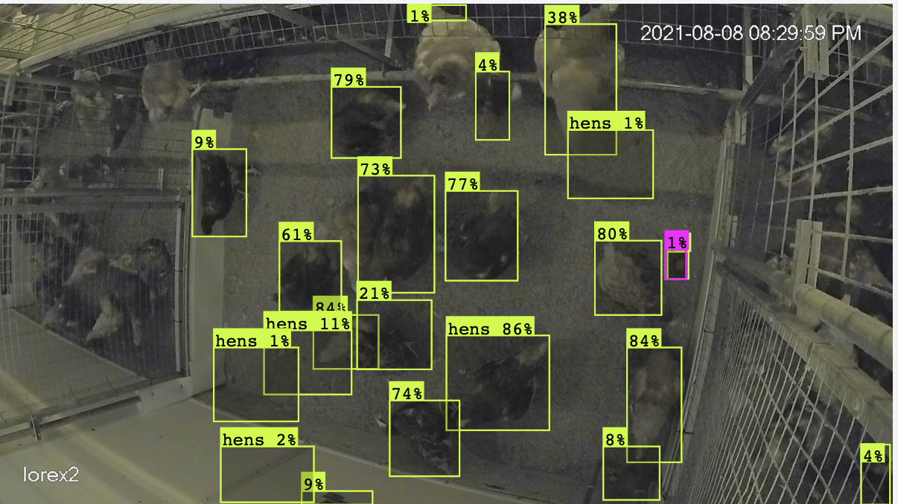
2. It utilizes a time interval of 1 second, with camera function assumed to be at 15 frames per second: essentially, a program that is capable of seeing 15 frames at any one time.
3. Can store the density value of each annotation: each annotation is framed within a 40x40, 80x80 or 20x20 file size. 
4. All steps of the function should be activated in one command.
5. It should be easy enough to understand for future work.

### Part 1: Confidence Value

The confidence determines how certain the model believes that a given predicted annotation matches with surrounding data of its class, on a scale between 0 and 1, rounded by the hundredth digit. YOLO has a parameter, listed as `confidence threshold` in the source code, and for this experiment, it will be set to 0% (or 0 or 0.00), such that every value should be listed.

### Part 2: Interval and Images

The model will compare 15 frames per second to see how hens move and when they lay eggs. Since a YOLO model itself will only take one image at a time, this boils down to how the program will be receiving input, likely from a frame-by-frame format (input and run for each frame that gets created by a camera).

### Part 3: Density of Images

Each image can be framed within a 40x40, 80x80, or 20x20 file size, relative to the original size of the image. This is typically done within the model, but for the sake of this process, it must be kept before it is finalized as one set of data.

### Part 4/5: Simplicity for Future

For easy work in future projects, the program must be made easy to understand, and functions in just one command, rather than having to fiddle with other processes just to use it. 

As such, there will be one program of which one command runs the entire model with necessary steps, and if necessary, I may add a side document explaining every additionally necessary detail within the program for reference and ease of usage.

### Code Confusion

A primary issue I'm having in writing code is that I cannot find a method that allows me to read what is inside the code of the model. The typical method for loading a file in PyTorch (TextEdit, a text writing software for Mac, or loading it into Visual Studio Code) will either fail to open due to probable corruption or strange characters (the former, TextEdit), or will load but not in proper text anyway (the latter, Visual Studio Code).

This leads to me being unable to understand how to properly input data, as I do not know how the format works, both in PyTorch files in general and with the specific model type. 

### Exporting Files from Roboflow

The beginning of the problems stems from the original program I had used, Roboflow. While it was good to begin using, it led to multiple technical problems due to some lack of organization regarding end products and exporting data.

In each annotated image from Roboflow, it does provide the raw data in code format, including the annotations, in a labeled format that matches the format for other YOLO annotations:

(Example taken from one image containing exactly one egg.) <br>

```
{
    "boxes": [
        {
            "label": "eggs",
            "x": "1465.31",
            "y": "561.91",
            "width": "39.34",
            "height": "48.42",
            "color": "#FF00FF"
        }
    ],
    "height": 1080,
    "key": "ch2_0808_2030_mp4-102.jpg",
    "width": 1920
}
```

However, taking this individually would mean copying and pasting such data for 81 images, with a varying number of annotations per image. Not a terrible task given the actual size of the data (and an already present copy-paste function), but it isn't scalable for much larger sizes of data.

<br>

Thankfully, I did find a simpler solution later: when downloading the files for the dataset in any format, it provides extra folders for the test, train, and validation images; each of these folders contains a folder of the text files of the annotations along with a folder of each of the respective images. 

Images are in .jpg format, likely based on their original formats or ones that are easily recognized by its respective program (I made ones in YOLOv5 and v8, and both were in .jpg format). Labels are text files, consisting of eight numbers and the label.

Example taken from one of my image data files.

```
164 291 226 291 226 357 164 357 hens 0
156 184 204 184 204 281 156 281 hens 0
171 138 233 138 233 196 171 196 hens 0
198 93 241 93 241 182 198 182 hens 0
248 74 306 74 306 133 248 133 hens 0
288 70 357 70 357 133 288 133 hens 0
311 40 373 40 373 94 311 94 hens 0
252 132 293 132 293 232 252 232 hens 0
224 215 269 215 269 322 224 322 hens 0
280 209 362 209 362 276 280 276 hens 0
375 207 437 207 437 273 375 273 hens 0
361 292 437 292 437 338 361 338 hens 0
409 252 456 252 456 327 409 327 hens 0
449 259 501 259 501 313 449 313 hens 0
422 166 463 166 463 220 422 220 hens 0
448 137 503 137 503 199 448 199 hens 0
```

This above format is slightly different than other formats present in YOLO annotations, very likely meaning the coordinates of the bounding box (top left, top right, bottom right, bottom left), and then the category at the end.

I also attempted it using the Multi-Label Classification under CSV, and instead got a result with a .csv file and its images, in a manner similar to DeepLabCut data (which I was having trouble previously due to the organization of the files):

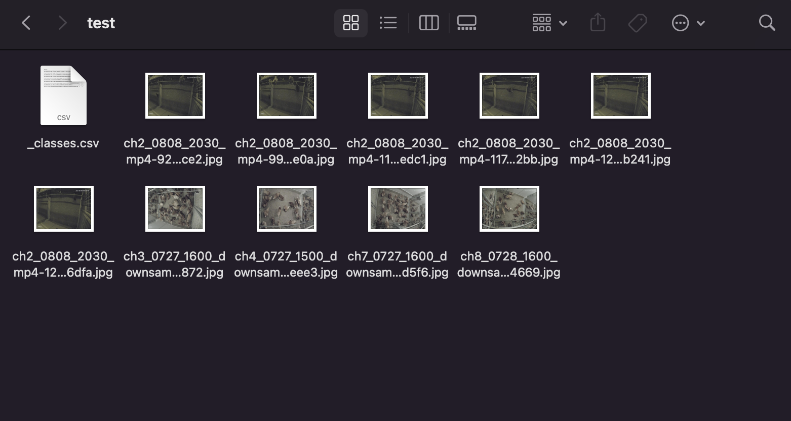
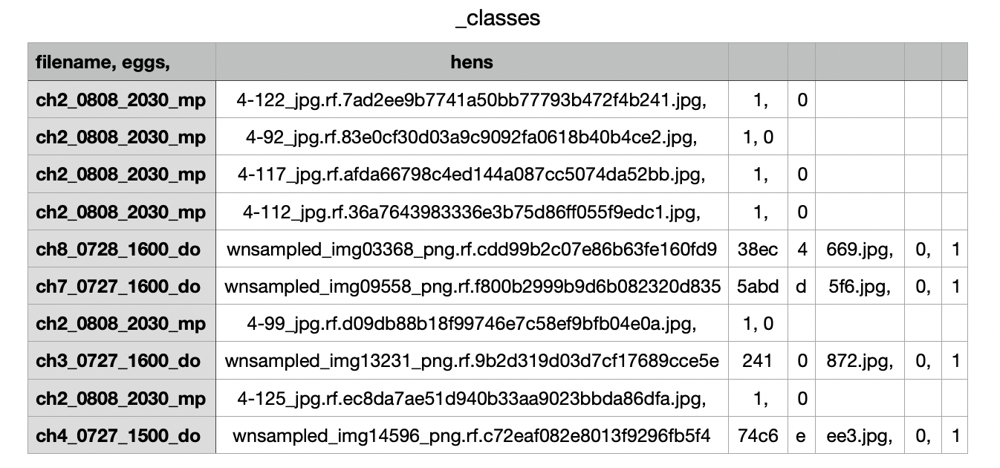
(The columns are spaced as oddly as they are due to the delimiters being used that may or may not be compatible in my current workspace, and also likely due to there being very few subject types.)

<br>

Lastly, I attempted using the COCO option under JSON, with this result below:
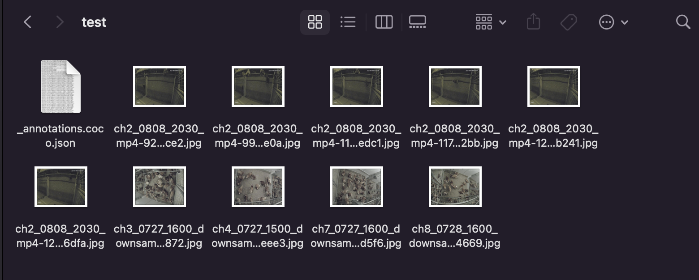

---

<br>

## (5/31 - 6/2) - The Core YOLO Process

Progress related to using programs like TorchStudio was scrapped. Instead, focus is changed to writing a script that can easily utilize the model I created originally, input image/video data, then output feature vectors that describe the annotations inside the images.

### How YOLO works

This example is based in YOLOv5, as there is an example model structure in the [documentation seen here](https://docs.ultralytics.com/yolov5/tutorials/architecture_description/#1-model-structure). Information is also provided by [this page on TowardsAI.net](https://towardsai.net/p/computer-vision/yolo-v5%E2%80%8A-%E2%80%8Aexplained-and-demystified). 


1. Input, Backbone:

When a YOLO model acquires an input image, it runs it through the backbone of the model, used to extract the important, informative features of the image. 

The backbone takes the image, and expands it with more categories and larger size, separating one image into multiple sections for which a model can analyze. Each function uses a format that dictates the size of the image and the number of categories in said image: (height, width, category), denoted as "h x w x c".

2. Processing, Neck:

Each subsection of images (40x40, 80x80 and 20x20) is processed by a given YOLO model to analyze and predict the locations of annotations in images, completed with category. 

YOLO processes data into a Feature Pyramid Network (FPN for short). Feature Pyramid Networks are layers of maps that formulate the information of images regarding object detection and succession from the object detecting function.

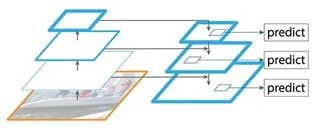

Information is provided from [this article](https://jonathan-hui.medium.com/understanding-feature-pyramid-networks-for-object-detection-fpn-45b227b9106c): FPNs use multiple layers of image maps to reconstruct and formulate a list of annotations based on different resolutions of the image, downsampling and upsampling as part of the formula. Lateral connections between layers and feature maps are added afterwards, to help predict locations better, as downsampling and upsampling can harm the precision of the model.

3. Output, Head:

After collecting all of the data from the above processing, the model organizes it into a spreadsheet composed of the following format: (category, x, y, width, height, score).

The category is the number related to a list found within the model data, from 0 to the total number
Values x and y denote the starting position of the bounding box, taken from the center values of the box. 

Width and height are exactly as it says, encompassing the entire bounding box based on the central location of the x and y values.
The score is the estimated confidence of the annotation, based on how well the model believes it is accurate compared to other data.

This output is formed for every bounding box present in the image, with each image getting its own set of data. 

---

<br>

## (5/29 - 6/2) - New Developments

This week, I spent some time to look further into the processes behind YOLO training, to see where I can use the programs to get what I need.

### Looking Online

Once again, I asked a GitHub discussion forum: this time (question posted 5/30 around 3:00), it was in Ultralytics in relation to uploading to TorchStudio, the main issue of which I'm finding difficulties.

### Rereading the Docs

(5/30): Upon rereading the main documentation for TorchStudio, I realized that I've misunderstood TorchStudio as its own program, rather than a software that loads PyTorch programs. As such, it shouldn't be as difficult to follow along with the documentation, as it loads the file path of a dataset, and uses it to simulate a model.

(5/31): I stand corrected, the above sentiment is no longer valid.

I followed along with the webpage of the [TorchStudio custom datasets tutorials](https://www.torchstudio.ai/customdatasets/):

My folder created through Roboflow contains the following items:

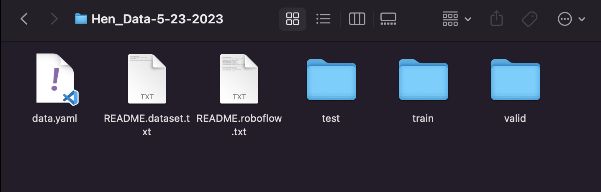

The last two folders are named "train" and "valid", and these two can be used in TorchStudio's training parameters. In each folder is the images and their respective label data.

Unfortunately, while Ultralytics itself provides a single file exported in ".pt" or one of the other formats, it doesn't provide a set of folders. As such, TorchStudio does not work with just the file from Ultralytics, as it cannot directly load the file or take it as input. 


Each time I attempt inputting the files, I get the same exact resulting error. There are very few documentations regarding this issue.

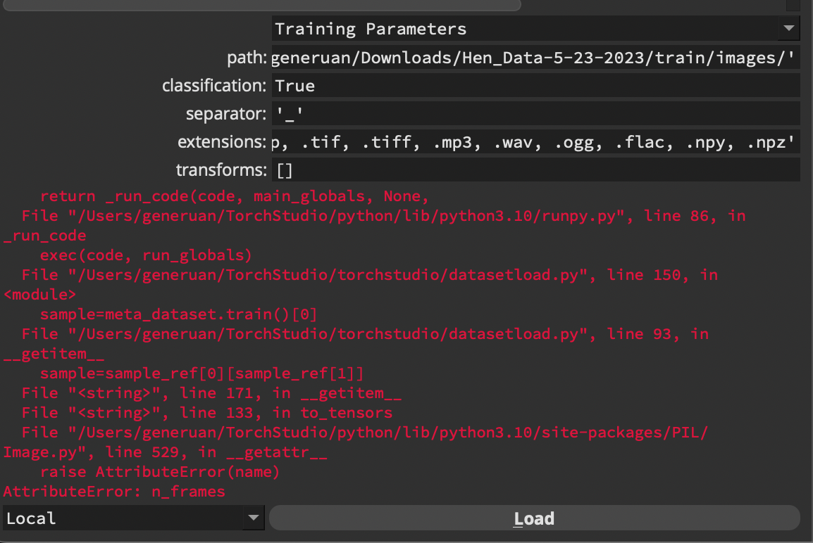

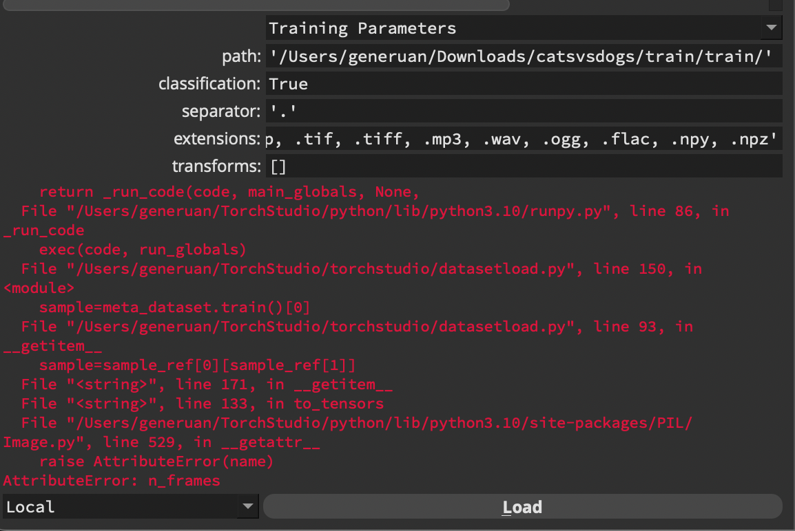
(The third image is *not* my input data, but rather an example dataset from which TorchStudio recommends, and one that *should* work theoretically.)

---

<br>

## (5/22 - 5/26) - First Impressions

I began by looking into the different programs utilized for YOLO training. This helps to provide a basic list of tools for future use with the trained models. 

## Ultralytics HUB - Training Models

Researching about training and deploying models of YOLOv5 or YOLOv8 leads to *Ultralytics HUB*, a platform developed by the same team as the YOLO systems to easily and quickly train models.

Ultralytics connects to a Google Colab document that allows for training new models without affecting the current operating system. I began by testing out a few model types, adjusting each variable to see what they do.

<br>

### Info taken from the advanced options in the Training tab:

**Epochs**: the number of passes, or trials, taken throughout a database. Increased numbers lead to longer wait times, but more accurate results. By default, it is set at 100.

**Image size**: the size at which a model uses to train data. Larger sizes are more accurate, smaller sizes are faster. By default, it was set at 640, but that may be due to the image sizes (I was testing with a model that used 640x640 scaled images).

**Patience**: the number of epochs at which a model may prematurely stop if it begins to detect little improvement. Higher numbers lead to longer waiting, smaller numbers may cut off the training early to reduce training time. By default, it is set at 100.

**Cache Strategy (None, RAM, Disk)**: If resources allow it, the training may move itself to the RAM or Disk space to speed up the training. By default, it is set to RAM.

**Device (GPU, CPU)**: Sets whether the GPU or CPU will be used for training. By default, it is set to GPU, with CPU being slower and only if GPU is unavailable.

**Batch Size (Auto, Custom)**: may set a certain number of images in batches for purposes in training, with larger batches making smoother gradients and faster training. By default, it is set to Auto, enabled to maximize utilization and minimize time spent.

<br>

### Training a Proper Model

After trying a few models with the default settings, I opted to change a few of them to get a better, more accurate model, first with the following settings, using model YOLOv5s6u:
(Epochs: 300, Image size: 640, Patience: 100, Cache Strategy: RAM, Device: GPU, Batch Size: Auto.)

I made this with the model I had created using Roboflow to start with (81 labeled images of hens), and allowed the computer to build the rest. Below are the results.

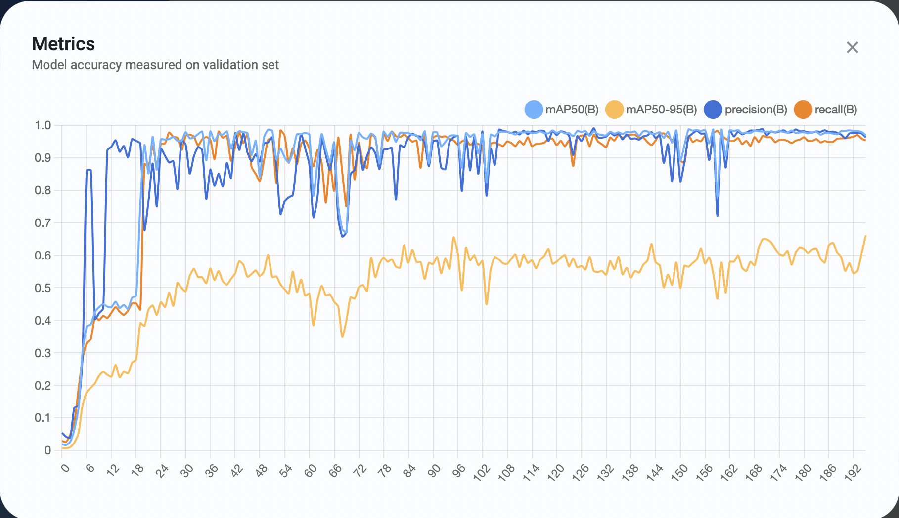
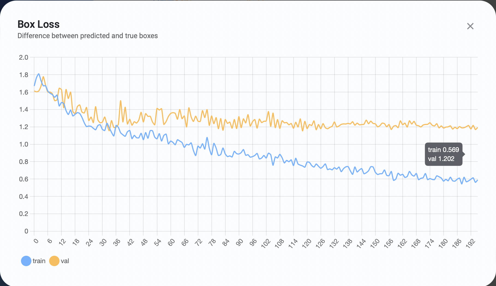
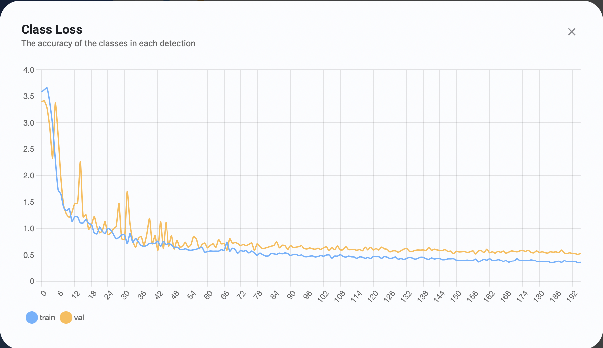
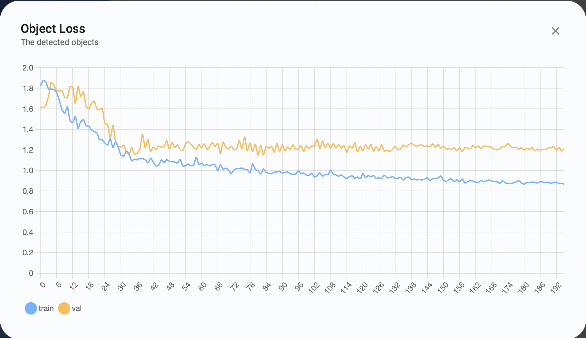

Below is an example image taken based on the preview option in Ultralytics. 


<br>

### Exporting Data

Ultralytics allows two methods for applying a model: offering the mobile app (which would be helpful for in-world data, but does not apply much to this situation), and exporting the data as one of many file options.


I have now run into a problem: Ultralytics HUb exports files in '.pt' format, but TorchStudio does not directly support this file type. According to the [docs for Ultralytics regarding custom data](https://docs.ultralytics.com/yolov5/tutorials/train_custom_data/#local-logging), it supports exporting to TensorFlow, ONNX, and other formats, but not specifically TorchStudio.

Searching online, not many sources feature TorchStudio tutorials and tips, possibly because it is relatively newer in comparison to other popular programs and content (2022 release). 

The PyTorch format itself is available on other platforms, with VSCode and PyCharm being my focus in particular (primairly because I already use these platforms, including VSCode used to write this very document). TorchStudio also has some availability to switch or export to other platforms: VSCode, PyCharm, Spyder, and Sublime Text (the only one of which I haven't used before).