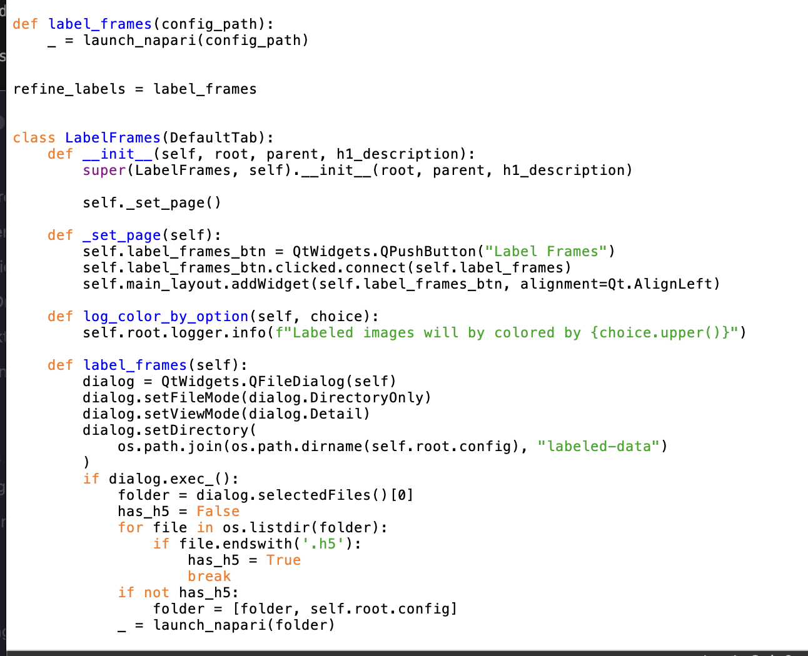
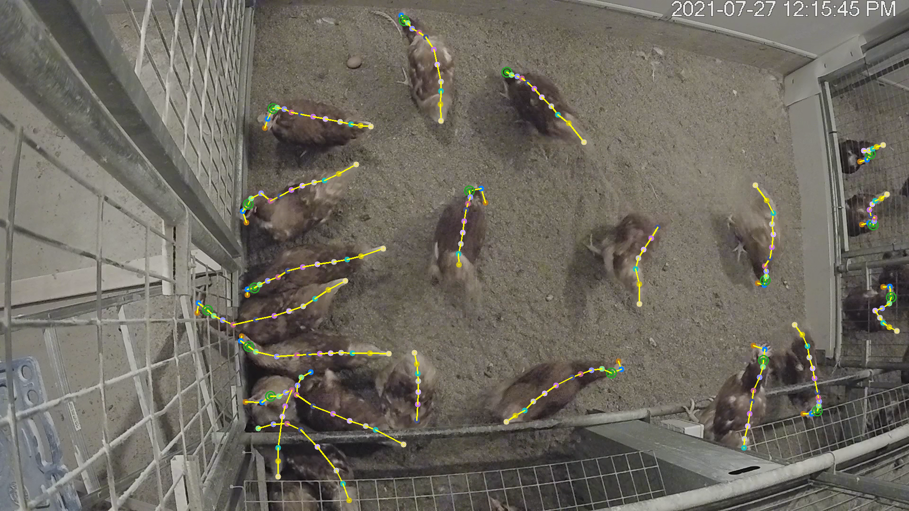

# DeepLabCut - How to Use

To open DeepLabCut with GUI in MacOS Terminal:

 1. Type `conda activate DEEPLABCUT_M1`
 2. Type `pythonw -m deeplabcut`


## Step 0: Before Opening DeepLabCut

Prepare all data necessary for annotations before opening DeepLabCut. Organize photos or videos into a separate folder or arranged in one's files for ease of access. 

## Step 1: Create a DeepLabCut Project

Open DLC and create a new project, with title and scorer variable. When accessing the file in the GUI, add new data by "Load New Videos" and "Add New Videos". This will add another file according to the path of the file on the computer.

Additionally, check each of the 'Optional Attributes' if necessary:
- 'Select the directory where project will be created': Browse for the file path where the file can be easily located.
- 'Copy the videos': Instead of dragging the image files directly from the file path, DLC makes a new folder that stores all of the images instead. 
- 'Is it a multi-animal project?': Single-animal and multi-animal projects have different requisites, dependent on the number of individual items intended from the images.
  - Single-animal: one item of interest in frame at any time. 
  - Multi-animal: multiple individuals of interest in each frame. Requires addition of individuals, see next step.


## Step 2: Configure the config file

Click on "Edit Config File" to open the file on the computer in a file editor (often Visual Studio Code). Scroll through to the end of the file, just under the `bodyparts` list. From here:
 1. Add each item of the intended annotation parts to the list of `bodyparts`.

```
multianimalbodyparts:
- Item 1-Start
- Item 1-A
- Item 1-B
- Item 2-Start
- Item 2-A
- Item 2-B
- Item 2-C
- Item 3-Start
```

 2. Go to `skeleton`; define connections using the '-' character, as shown below.
```
skeleton:
- - Item 1-Start
  - Item 1-A, connected to Item 1-Start
  - Item 1-B, connected to Item 1-A
- - Item 2-Start
  - Item 2-A, connected to Item 2-Start
  - Item 2-B, connected to Item 2-A
  - Item 2-C, connected to Item 2-B
- - Item 3-Start
```


 3. Optionally, define the color of the skeleton, next to `skeleton-color`. 
 4. If in a multi-animal project, add a number of `individual#` (replace # with an increasing number, 20 is a good start for small projects, expect up to 100 or more for bigger projects); for example: 

```
individuals:
- individual1
- individual2
- individual3
- individual4
- individual5
- individual6
- individual7
```

Save file and exit, move to next tab to begin labeling.

## Step 3: Extract and Label Frames

If the input files were images, this step may not be necessary. Otherwise, move to the 'Extract Frames' tab on the GUI, select the config file, then run the file to extract all frames from videos. 

Then, begin labeling frames through the next tab, 'Label Frames', and begin labeling each frame. The order of the annotations are based on the list of 'bodyparts' outlined in Step 2. Due to model accuracy being dependent on the accuracy of the annotations in this stage, take as much time as necessary to be as accurate as possible.

## Step 4: Begin Training

Once all images have been labeled, move to the next tabs, 'Create Training Network' and 'Train Network'. Create a training network through the options in the former tab, and begin waiting. This takes a long time, so prepare to wait around and do something else, but be sure that the computer remains on and running to prevent accidents and errors.

After it is done, use 'Evaluate Network' to see the accuracy of the model. 

In order to analyze new data, begin by analyzing new video data in the 'Analyze Videos' tabs, then creating videos in the 'Create Videos'. It is required to analyze before creating, as otherwise DLC runs an error of 'No unfiltered data'. 

<br>


# DeepLabCut - Creating and Testing a Training Model for Analyzing Hens

## (5/15 - 5/19/2023) - Pre-Annotated Data

This week, I am continuing to attempt reusing the data present in the Google Drive to make a functional data set, to apply using external data to make a model. 

For consistency sake, I used one specific set of data, the folders `ch1_0727_1200` and `ch1_0727_1200_labeled`, being a set on three images, the annotation data, and the respective labeled images.

## Multiple Files in One Folder

The main challenge of this task is that, unlike the other tests where I had created my own data, the external data consists of multiple images in one folder, rather than one image per folder, with two annotation files (one in CSV and one in H5) encompassing all of the data in the images.

See example here (first image is from the data, second image is my own):


As such, transfer is not as one-to-one as the other data sets, and requires a bit more work to get started.

Attempts to test a single folder of the external example doesn't work, because DeepLabCut requires at least one image to get started, and an initial input tends to separate each image into its own folder. I have also attempted to separate the CSV file into separate files associated with the proper images in the previous report, but failed to get DeepLabCut to convert the CSV files into H5.

I did initially make a mistake and forgot to change the scorer variable, but that did not change anything about the end result: DeepLabCut still thinks that there is no labeled data, despite one folder of three images that contains it, and one folder that contains the end results.

## Looking Online for Assistance

(5/16)
I looked primarily on the Official DeepLabCut GitHub for help on this multi-image examples, sourcing dozens of prior issues and documents in the meantime. Except, very little information was what I need to find, so I tried to ask a question about it. However, it has been some time since the last instance of which I asked about an issue, so I have no recollection of how to do so.

(5/17) 
Found it; it's in the same spot as bug report, but most of the time it can be used to ask questions where needed. I find it nonindicative. On this day, I sent a bug report asking for the problem outlined above, and awaited feedback.

## Looking in the Code

In my 5/17 meeting, I was recommended to look at the code of the DeepLabCut program to see how the program sees annotations, and how it may not read the current data present.

Information about DeepLabCut can be found in its own folder, provided when downloading DeepLabCut onto a computer. The details about the training dataset (the specific section where I am having difficulties) can be found in the 'trainingsetmanipulation' Python file, in the 'generate_training_dataset' folder; this is where the following error message occurs:


According to the code, in the `dropduplicatesinannotationfiles` function, the error message runs when it cannot find the file in question, based on a `FileNotFoundError`. Searching backwards, the folders stem from the config file path name within 'labeled-data', specifically based on the **names of the videos**.

Thus, it's looking for folders based on the names of the images in the 'videos' folder, and when it can't find them because the names of the folders containing the data don't line up, it runs this error. As such, I need to find a method that matches the names of the videos with the names of the folders.

Here is the code in question:

```
def dropduplicatesinannotatinfiles(config):
    """

    Drop duplicate entries (of images) in annotation files (this should no longer happen, but might be useful).

    Parameter
    ----------
    config : string
        String containing the full path of the config file in the project.

    """
    cfg = auxiliaryfunctions.read_config(config)
    videos = cfg["video_sets"].keys()
    video_names = [Path(i).stem for i in videos]
    folders = [Path(config).parent / "labeled-data" / Path(i) for i in video_names]

    for folder in folders:
        try:
            fn = os.path.join(str(folder), "CollectedData_" + cfg["scorer"] + ".h5")
            DC = pd.read_hdf(fn)
            numimages = len(DC.index)
            DC = DC[~DC.index.duplicated(keep="first")]
            if len(DC.index) < numimages:
                print("Dropped", numimages - len(DC.index))
                DC.to_hdf(fn, key="df_with_missing", mode="w")
                DC.to_csv(
                    os.path.join(str(folder), "CollectedData_" + cfg["scorer"] + ".csv")
                )

        except FileNotFoundError:
            print("Attention:", folder, "does not appear to have labeled data!")

```


## Revisiting the Problem

After figuring out the above, I looked into altering files to see how I can cause DeepLabCut to register the files as they come. Seeing as at this point (5/18-5/19), no return topic has come back from GitHub, I just tried what I could:

1. **Trial 1**: I tried to directly input the folder where the images would go. Erred.

2. **Trial 2**: Removed the additional data files, but kept the image folder as is. Erred.
3. **Trial 3**: Placed the data files into each separate folder instead. Erred, but with a different error output.
    1. **3-1**: Added the labeled images manually with separate folders. Got the same error.

Example of **Trial 1**:


Error message from **Trial 3**:


The second error output stems from the listed programs in the error message. According to the code, in the `label_frames.py` file in the `gui` folder: 



---

<br>

## (5/8 - 5/12/2023) - Pre-Annotated Data, Application

This week was applying last report's techniques and ideas in order to make a functional data set.

## Single-Animal, Redone

I began by reusing the old data used in my clocks test (see 4/10 notes for single-animal reference), to see if it can be applied in that method for single-annotation; then I can apply it for the multi-animal test (see 4/17 notes for multi-animal reference).

I used a large number, 5000 iterations for this test, mostly to see if it can be done as accurately as, or more accurate than the original.

As expected, the new model with old data worked just as well as the original, with just as much inaccuracies and lack of composition in annotations as the original: at least it works, and that's all I needed from the test.

## Multi-Animal, Redone, Simple

I used the multi-animal test from 4/17 to reapply the concept for another model, to make before trying to use the data in the Google Drive.

Just as the single-animal test, I used more iterations (1000, reduced from single-animal due to longer training times, but still more than the original 500), as I do have more time and can use the extra analysis for better models.

Also as expected, the new model is functional and does work, similarly to testing the single-animal model with the exact same data.

## Reusing Older Data from Google Drive

After creating and using the multi-animal test, I seeked to reuse the old data present from the Google Drive to recreate a model. The first issue was transferring '.png' files into the program, as my program has issues using '.png' files, but accepts '.jpeg' images fine. 

I made a trial with only one set of images, and one set of data, separating the single '.csv' file into three, one per image. This is simply to see whether this is a viable option, before any long term programming was made.

---

<br>

## (4/24 - 4/28/2023) - Pre-Annotated Data, Theory

This week's focus is on grabbing data from external data: config files and pre-annotated images.

However, this week was primarily spent on the theory of making this type of DLC project (mostly due to exams). By the next report, I will begin to make a real project using external data.

## How Annotation Data Works

Annotation data comes in the form of coordinates in a H5 file in DeepLabCut, but comes as a CSV file in other annotation formats. DLC supports a file converted in H5, but not in CSV, but will automatically convert data in CSV format (created when annotating images in GUI) into H5 format.

For a CSV file, annotation data is formatted by the X and Y pixel coordinates, body part names for each annotated part, the path to the image and scorer name (which must match the name in the config file).


To convert a file from CSV to H5, type: 'deeplabcut.convertcsv2h5' in a command window, along with the requisite CSV file.


External example files from this project were saved in JSON format, which can be converted to CSV. There are many methods for converting JSON to CSV, or JSON directly to H5, find one that works. (Note from me: I don't currently have an answer for this yet.)

## Using Config Files and Pre-Annotated Data

The key difference of using other config files is the paths of files; different operating system uses different types of file paths, making it difficult even if every video and/or image is the exact same, in the same place and folder.

However, while this can be remedied by manually copying each file path based on the current user's path, the better solution may be simply not to use external config files. Config files have a scorer name variable tied to it, alongside the other differences above, and the time spent altering each section of the file can be better spent by creating a new file to do the same.


As seen above, there is the file path for the videos, which is different than below, which came from my computer (a MacBook Pro, for reference).


### Step 1: Creating a Config File for Pre-Annotated Data

Create a config file with all of the necessary images. Follow instructions below for instructions on how to make Single-Animal or Multi-Animal data sets. 

Individuals, bodyparts, and skeletons may be duplicated straight from other config files, and try to use pre-annotated images, but in a file path and format that the current computer uses.

### Step 2: Uploading Annotation Data

Extract frames, but instead of moving directly into annotating images, hop into the files and go to the 'labeled data' folder, then into each image folder. From there, upload the H5 and/or CSV file with its corresponding image. (The below images were taken from my previous training set as an example.)


Upload the completed annotation data into the folder of each image (see third image), then move forward. It may be necessary to reload DeepLabCut and the config file to ensure all annotations were properly uploaded.

### Step 3: Training the Model

Train and evaluate the model in the same method as the other models: train a number of iterations, then analyze with test data.

---
<br>

## (4/17 - 4/21/2023) - Multi-Animal Testing

This is a proper attempt, last week's attempt was stuck bouncing around between a few types of data.

Mushrooms were an idea, but upon realization that finding moving data for later would be impossible, it was quickly scrapped. I also tried to use schools of fish (particularly salmon), but it was difficult to try and annotate spots on all of them, and undersea footage is often foggy and unclear.

Eventually, I settled on annotating a small number of images taken as frames from the 'AllExtractedFrames' folder in the Google Drive. Specifically searching for images with little hens in the main image, I can gather data that could be used as a start for testing.

### Part 1: Finding Suitable Data

Image data is taken directly from the 'AllExtractedFrames' folder in the Google Drive. As stated above, data was more selective, taking smaller scaled images to avoid spending too much time annotating.

Unlike the real data sets made for the project, my test data only includes the head, tail, and small parts down the spines of each hen. This is also to reduce time spent annotating, especially given data already exists for extensive annotations throughout the hens.

### Part 2: Creating a Project

Multi-animal projects require a list of individiuals, of which the skeleton will be replicated for each individual in the list. I made a list of around 60, but don't expect to use the full amount as the images are intentionally smaller.

individuals:
- individual1
- individual2
... (ad nauseam)

I did not individually type these all out. I copied the full list of individuals from the other config file present in 'DLCProjectFiles'.

Body parts and skeleton are as follows below. The body parts list is a shortened version of the list outlined in the GitHub [linked here](https://github.com/dmorris0/Hen-Detection/blob/main/Annotations.md), or see below. Each of these body parts are shared among every animal, so there is no need to fill the 'uniquebodyparts' tag.



```
bodyparts:
- head
- spine
- tail
```

In place of the three 'beak' and 'hackle' sections is the 'head', and in place of all four 'spine' and 'tail' sections is just the one 'spine' and 'tail' respectively. Comb and blade are also omitted for this trial. Follow the descriptions in the GitHub source linked above for more details on each part of the hen that is being tracked.

(It was initially a 'beak' and 'neck' instead of just a 'head', but after having difficulties finding the beak and neck on hens when zoomed in, I figured it would be easier to track in this manner, especially for a small test.)

```
skeleton:
- - head
  - spine
  - tail
```

Once again, just like the clock trial in (4/10-4/14), there is no need for multiple skeletons each pointing to separate objects, just one that marks down the line from beak to tail on a hen. 

### Part 3: Getting Training Data

Initially, the images from the Google Drive are PNG files. However, while online sources state that OpenCV (and by extension, DeepLabCut) supports this file format, I was having trouble getting DeepLabCut to begin extracting data from these files, so I converted these into JPEG files, a file type that I had used previously for the single-animal test data that functioned. Indeed, after running a new test file, it worked with JPEG files.

<br>

*(Future Addendum, added 5/15: the above statement is not remotely true; JPEG files do require being extracted, and PNG files cannot be extracted at all. However, both file types work, it's just that PNG files skip the stage at which image data must be extracted.)*

<br>

Annotating does get a little more tedious, but that is par for the course for multi-animal projects: it's expected to take long period of times to accurately annotate everything necessary, even if the test data in this scenario is smaller. If parts of the hen were indistinguishable (mostly between head and tail), it was ignored to avoid false data.

This time, I used a properly small number of iterations (500 total), to avoid waiting too long for a data set, though in exchange for one that is less accurate.

---

<br>

## (4/10 - 4/14/2023) - 1: Single Animal Testing

By recommendations from Professor Morris, I revised the type of data and how it would be tracked.

Instead of testing how to track all of the parts of an object (still using clocks to test a simple set), I should instead focus on one part of the object and track that part's motion.

For example, track only the minute hand on a clock as it moves. In this instance, it would best mimic the data process of tracking hens, of which the real data forms a line down the general spine of a hen. 

### Part 2: Creating a Project

See the 4/3-4/7 time stamp for Part 1 in finding data. It is exactly the same step in this case. 

Instead of having separate markers for separate points, I used these label markers and skeleton.

```
bodyparts:
- center
- minute1 
- minute2
- minute3
- minute4
```

Each minute section represents one (1) quarter (1/4) more down the minute hand. I am using the minute hand, as it is longer than the hour hand, for ease of annotations. 

```
skeleton:
- - center
  - minute1
  - minute2
  - minute3
  - minute4
```

Because this annotation style relies only on one subject within the object, there is no need for multiple skeleton frames. Instead, it is one skeleton framework that encompasses the entire area of the minute hand; a method to replicate that of the annotation framework down the spine of a hen.

### Part 3: Getting Training Data

I put too many total iterations into the program, and ended up waiting over two hours to get 5000 iterations of training done. Do not use this many for simple training, use a reduced amount. On the flip side, a high number of iterations does make a model more accurate. 

After training, run evaluations in the next tab. Afterwards, analyze videos in the next tab afterwards.

Many stock videos are completely free, often barring a small watermark someplace. As such, I used free stock data of clocks moving to test the model.

---

<br>

## (4/10 - 4/14) - 2: Multi-Animal Testing

After getting a functional model of 'single-animal' testing, I began working on trying a test 'multi-animal model'. However, instead of heading straight into large batches of data, which would take far too much time for a simple trial, I searched for small data of multiple animals and opted for simple annotation skeletons, rather than trying complex frames.

### Part 1: Finding Suitable Data

For some data, I tried to find some data online, but ended up using a few small images from the hens document, ones that have very few numbers. Many of the images in the 'AllExtractedFrames' folder have very few hen in the main camera and the rest are cropped out, so I used those as test data first.

### Part 2: Creating a Project

With multi-animal projects, a list of individuals must be created; this number should be more than the total number of individuals in any image, though images can have less. I added 60 in total, expecting only a few from selectively picking out smaller sets.

---

<br>

## (4/3 - 4/7/2023)

### Part 1: Finding Suitable Data

To make an easy trial for simplistic testing, I used one that was quick to find en masse and in enough quantity. An easy one to track is one I found from [a similar tutorial](https://guillermohidalgogadea.com/openlabnotebook/training-your-first-dlc-model-/): they used clocks for single-animal tracking. 

Clocks have two hands, the minute and hour hands respectively, though the tutorial above adds the center, the hand denoting seconds, and 'twelve' (the point at 12 on any clock, likely for reference). 

Data is taken from photos of clocks viewed as various angles, to ensure that the program can read the data from a whole variety of angles; this type of data is to be mimicked for the actual project subject of hens. There were 10 photos taken for a simple starting data set. A few of the images didn't work, so I left it at 6.

### Part 2: Creating a Project

This project is defined as a single-target project: there is typically one clock for marking, and no others present in view for this experiment. Thus, there is no need to add individuals in the project files.

Labels are defined as follows:
```
bodyparts:
- center
- hour
- minute
- second
- twelve
```

The skeleton is altered to individually connect each point to center:
```
skeleton:
- - center
  - hour
- - center
  - minute
- - center
  - twelve
- - center
  - second
```

After extracting frames from each input file, labeling begins. Labels run in order of creation. 

### Part 3: Getting Training Data

I used a smaller number of training iterations in the 'Train' tab, dropping each number of iterations 100 times smaller.

Then, I used a video I found online to test all the evaluation and see what they look like. 

---

<br>

# Additional References and Notes

Since testing this project requires lots of new config files and data sets, this additional section is for all of the necessary code segments to quickly add data into each new file. Simply copy and paste each section into your file as required.

## Bodyparts and Skeleton

The latest files for hens all have the same bodyparts, no need for unique segments. Below is the complete list of bodyparts, as well as its skeleton in proper formats.

```
uniquebodyparts: []
multianimalbodyparts:
- beak
- comb
- blade
- hackle1
- hackle2
- hackle3
- spine1
- spine2
- spine3
- spine4
- tail1
- tail2
- tail3
bodyparts: MULTI!
```

There are multiple types of skeleton format (due to uncertainty as to which method DeepLabCut allows). 

Type 1: each segment is individually connected to each other, doing the work for DeepLabCut to follow.

```
skeleton:
- - beak
  - comb
- - comb
  - blade
- - blade
  - hackle1
- - hackle1
  - hackle2
- - hackle2
  - hackle3
- - hackle3
  - spine1
- - spine1
  - spine2
- - spine2
  - spine3
- - spine3
  - spine4
- - spine4
  - tail1
- - tail1
  - tail2
- - tail2
  - tail3
```

Type 2: the skeleton is strung together, but may make DeepLabCut do more inferences and calculations.

```
skeleton:
- - beak
  - comb
  - blade
  - hackle1
  - hackle2
  - hackle3
  - spine1
  - spine2
  - spine3
  - spine4
  - tail1
  - tail2
  - tail3
```

Type 3: there is no skeleton at all. Seen in some of the previous config files, and may have to do with the order of the bodyparts, letting DeepLabCut do all of the work, or how DeepLabCut functions without the GUI.

```
skeleton:
```

## 100 Individuals

Due to the nature of the project, a large number of individual labels is required to match the sheer number of hens in each coop. As such, this is a reference to easily copy/paste the 100 individual labels necessary to proceed.

```
individuals:
- individual1
- individual2
- individual3
- individual4
- individual5
- individual6
- individual7
- individual8
- individual9
- individual10
- individual11
- individual12
- individual13
- individual14
- individual15
- individual16
- individual17
- individual18
- individual19
- individual20
- individual21
- individual22
- individual23
- individual24
- individual25
- individual26
- individual27
- individual28
- individual29
- individual30
- individual31
- individual32
- individual33
- individual34
- individual35
- individual36
- individual37
- individual38
- individual39
- individual40
- individual41
- individual42
- individual43
- individual44
- individual45
- individual46
- individual47
- individual48
- individual49
- individual50
- individual51
- individual52
- individual53
- individual54
- individual55
- individual56
- individual57
- individual58
- individual59
- individual60
- individual61
- individual62
- individual63
- individual64
- individual65
- individual66
- individual67
- individual68
- individual69
- individual70
- individual71
- individual72
- individual73
- individual74
- individual75
- individual76
- individual77
- individual78
- individual79
- individual80
- individual81
- individual82
- individual83
- individual84
- individual85
- individual86
- individual87
- individual88
- individual89
- individual90
- individual91
- individual92
- individual93
- individual94
- individual95
- individual96
- individual97
- individual98
- individual99
- individual100
```